# CloudFlare-ImgBed

开源图片/文件托管解决方案，基于 Cloudflare Pages 和 Telegram，支持 Telegram Bot 、 Cloudflare R2 ，S3 API 等多种不同存储渠道。

**前端仓库**：[MarSeventh/Sanyue-ImgHub](https://github.com/MarSeventh/Sanyue-ImgHub)

> [!IMPORTANT]
>
> **v2.0 版本升级注意事项请查看公告！**

<details>
    <summary>公告</summary>


## 置顶

部署使用出现问题，请先仔细查阅文档、常见问题解答以及已有issues。
**注意**：本仓库为[Telegraph-Image](https://github.com/cf-pages/Telegraph-Image)项目的重制版，如果你觉得本项目不错，在支持本项目的同时，也请支持原项目。

## 2025.2.6  V2.0 版本升级注意事项

> v2.0 beta 版已发布，相较于 v1.0 版本进行了大量改动和优化，但 beta 版本可能存在潜在不稳定性，若您追求稳定，可选择暂缓更新。
>
> 由于**构建命令发生了变化**，此次更新需要您**手动进行**，请按照以下步骤进行操作：
>
> - 同步fork的仓库至最新版（若已自动同步可忽略）
>
> - 前往 pages 管理页面，进入`设置`->`构建`，编辑`构建配置`，在`构建命令`处填写`npm install`
>
>   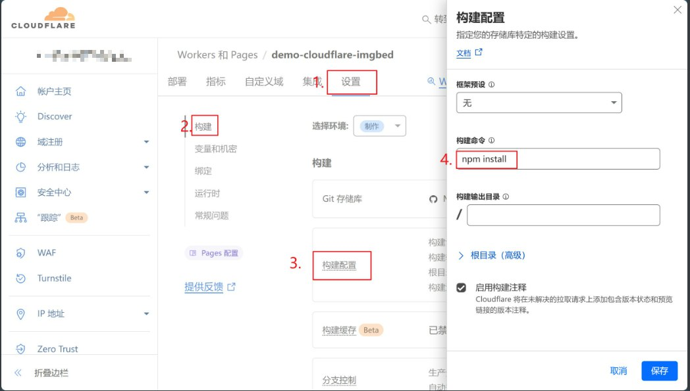
>
> - 新版本所有设置项已**迁移至 管理端->系统设置 界面**，原则上无需再通过环境变量的方式进行设置，通过系统设置界面进行的设置将**覆盖掉**环境变量中的设置，但为了保证 **Telegram渠道的图片** 能够与旧版本相兼容，**若您之前设置了 Telegram 渠道相关的环境变量，请将其保留！**
>
> - 确保上述设置完成无误后，前往 pages 管理页面，进入`部署`，对最后一次不成功的部署进行`重试操作`

## 关于切换到 Telegram 渠道的通知


> 由于telegraph图床被滥用，该项目上传渠道已切换至Telegram Channel，请**更新至最新版（更新方式见第3.1章最后一节）**，按照文档中的部署要求**设置`TG_BOT_TOKEN`和`TG_CHAT_ID`**，否则将无法正常使用上传功能。
>
> 此外，目前**KV数据库为必须配置**，如果以前未配置请按照文档说明配置。
>
> 出现问题，请先查看第5节常见问题Q&A部分。

</details>

<details>
    <summary>体验地址及优质博文、视频（搭建或使用有问题可以先去里面学习哦~）</summary>


**体验地址**：[CloudFlare ImgBed](https://cfbed.1314883.xyz/)

> 访问码：cfbed

**体验视频**：[CloudFlare免费图床，轻松守护你的每一份精彩！_哔哩哔哩_bilibili](https://www.bilibili.com/video/BV1y3WGe4EGh/?vd_source=da5ecbe595e41089cd1bed95932b8bfd)

**相关教程视频**：

- [利用Cloudflare R2 +Pages搭建在线图床系统，不限空间，不被墙，超级简单，完全免费 (youtube.com)](https://www.youtube.com/watch?v=T8VayuUMOzM)

**相关优质博文（感谢每一位鼎力支持的热心大佬）：**

- [CloudFlare-ImgBed项目 – yunsen2025的小窝](https://www.yunsen2025.top/category/cloudflare-imgbed/)
  - [完全免费，图文教程手把手教你使用cloudflare搭建一个无限空间的私人图床 支持身份认证与成人元素鉴定！ - yunsen2025的小窝](https://www.yunsen2025.top/blog-cfpages-syq-imgbed)
  - [为CloudFlare-ImgBed图床配置国内CDN并分线路解析，以最低成本享受极致速度！ – yunsen2025的小窝](https://www.yunsen2025.top/cloudflare-imgbed-fen-xian-pei-zhi-guo-nei-cdn/)
- [利用cloudflare pages搭建telegram频道图床 (lepidus.me)](https://blogstr.lepidus.me/post/1725801323700/)
- [搭建基于CloudFlare和Telegram的免费图床教程 - 刘学馆 | Blog (sexy0769.com)](https://blog.sexy0769.com/skill/735.html)
- [CloudFlare+Github，打造属于自己的免费图床 - 大头钉的小小blog (luckyting.top)](https://luckyting.top/index.php/archives/20/)

</details>

<details>
    <summary>更新日志</summary>


## 2025.2.6

**v2.0版本焕新登场**，带来多项新功能和优化，给您焕然一新的用户体验：

💪**更强大**：

- 接入 S3 API 渠道，支持 Cloudflare R2 , Backblaze B2 ，七牛云，又拍云等多个服务商的对象存储服务
- 支持设置多个 Telegram 和 S3 渠道，支持多渠道负载均衡
- 上传文件支持短链接命名方式

✈️**更高效**：

- 全部设置项迁移到管理端系统设置界面，无需进行环境变量的繁琐配置，立即设置立即生效
- 管理端 Gallery 和 用户管理 等页面实现分页读取，提升前端渲染速度，优化使用体验
- 支持禁用、启用渠道，渠道管理自在掌握
- 多个设置项加入提示弹窗，不用到处翻阅文档，设置更踏实

✨**更精致**：

- 全局支持深色模式，根据用户喜好和时间自动切换，凸显满满高级感
- 登陆页面、图库页面、用户管理页面等多个页面细节重新打磨，操作更直观
- 上传页全新 Tab 栏，一拉一合，灵动又便捷
- Logo 焕新，纯手工打造，能力有限，不喜勿喷（
- 支持自定义隐藏页脚，强迫症患者有救啦

## 2024.12.27

Add Features:

- 支持通过环境变量自定义全局默认链接前缀（见3.1.3.6自定义配置接口）
- 管理端支持自定义链接前缀
- 管理端部分页面展示效果优化
- `/upload`API支持返回完整链接（请求时设置`returnFormat`参数，详见API文档）

Fix Bugs:

- 优化上传页面显示效果

## 2024.12.20

Add Features:

- 管理端支持拉黑上传IP（Dashboard->用户管理->允许上传）
- 管理端批量操作支持按照用户选择的顺序进行（[#issue124](https://github.com/MarSeventh/CloudFlare-ImgBed/issues/124)）
- `random`接口优化，减少KV操作次数，增加`content`参数，支持返回指定类型的文件
- 接入CloudFlare Cache API，提升 list 相关接口访问速度
- 正常读取返回图片的CDN缓存时间从1年调整为7天，防止缓存清除不成功的情况下图片长时间内仍可以访问的问题

## 2024.12.14

Add Features:

- 管理端增加批量黑名单、白名单功能

## 2024.12.13

Add Features:

- 优化blockimg、whitelistmode、404等返回状态的缓存策略，尽可能减少回源请求(参考文档`3.1.3.9管理端删除、拉黑等操作优化`进行设置)

## 2024.12.12

Add Features: 

- 后端支持上传失败自动切换其他渠道重试
- 优化404、blockimg、whitelistmode等返回状态的显示样式

## 2024.12.11

Add Features:

- 进行删除、加入白名单、加入黑名单等操作时，自动清除CF CDN缓存，避免延迟生效(参考文档`3.1.3.9管理端删除、拉黑等操作优化`进行设置)

## 2024.12.10

Add Features:

- 文件详情增加文件大小记录

## 2024.12.09

Add Features:

- 开放更多文件格式

Fix Bugs:

- 读取文件响应头增加允许跨域头`access-control-allow-origin: *`

## 2024.12.04

Add Features:

- 支持自定义命名方式（仅原名 or 仅随机前缀 or 默认的随机前缀_原名）
- Telegram Channel渠道上传文件记录机器人和频道数据，便于迁移和备份
- 支持自定义链接前缀

Fix Bugs:

- R2渠道在管理端删除时，存储桶同步删除

## 2024.11.05

Add Features:

- 增加对R2 bucket的支持

## 2024.10.20

Add Features:

- 页脚增加自定义传送门功能

## 2024.09.28

Add Features:

- 上传页面右下角工具栏样式重构，支持上传页自定义压缩（上传前+存储端）
- 增加仅删除上传成功图片、上传失败图片重试

## 2024.09.27

Add Features:

- 上传页面点击链接时，自动复制到剪切板
- 上传设置记忆（上传方式、链接格式等）

Fix Bugs:

- 若未设置密码，无需跳转登录页

## 2024.09.26

Add Features:

- 优化粘贴上传时的文件命名方法

## 2024.09.12

Add Features:

- 增加背景透明度支持自定义

## 2024.09.11

Add Features:

- 支持背景切换时间自定义

## 2024.08.26

Add Features:

- 支持大于5MB的图片上传前自动压缩
- 图床名称和Logo支持自定义
- 网站标题和Icon支持自定义

## 2024.08.23

Add Features:

- 支持URL粘贴上传

## 2024.08.21

Add Features:

- 完善多格式链接展示形式，增加UBB格式链接支持
- 完善登录逻辑，后端增加认证码校验接口

## 2024.07.25

Add Features:

- 增加随机图API

Fix Bugs:

- 修复API上传无法直接展示在后台的问题

## 2024.07.22

Add Features:

- 增加粘贴图片上传功能

## 2024.07.21

Add Features:

- 增加Markdown、HTML等格式链接复制功能
- 上传页面增加管理端入口

</details>

# 1.Introduction

免费图片托管解决方案（支持存储绝大多数常见格式的**图片、视频、动图**等），具有**后台管理、图片审查**、**登录鉴权**、**页面自定义**、**多种方式及多文件上传**、**多文件及多格式链接复制**等功能（详见[第2章](#2.Features))。

此外，上传**并没有严格限制文件类型**，理论上你可以上传**任何**文件，但是暂时不会针对图片和视频外的文件进行特殊优化和适配。


# 2.Features

<details>
    <summary>项目特性</summary>

- **开源**
  
  - 前端开源（可自行修改、打包使用）
  
- **炫酷的动效（**
  
  - 流畅丝滑的过渡动画~
  - 上传文件实现呼吸灯效果
  - 灵动的操作体验
  
- **人性化上传**
  
  - **覆盖大多数文件格式**：支持绝大多数常见**图片、视频、动图**等，同时也支持其他大多数格式的文件
  
  - **支持多种存储渠道**：支持 **Telegram Bot**, **Cloudflare R2**, **S3**  等多种存储渠道一键切换
  
    > Telegram Bot渠道：上传文件大小限制为20MB，提供客户端和服务端压缩功能
    >
    > Cloudflare R2渠道：上传大小不限，但超过免费额度会扣费，详见[Pricing | Cloudflare R2 docs](https://developers.cloudflare.com/r2/pricing/)
    >
    > 
  
  - **上传方式多样**：支持多种上传方式（**拖拽点击、粘贴**）（Web/API)
  
    > 1. 粘贴上传支持**文件**和**URL**
    > 2. 支持批量上传（不限同时选择文件数量，但为了保证稳定性，同时处于上传状态的文件最多为10个）
    > 3. 上传显示实时上传进度
    > 4. Web和API端上传图片，均可直接展示在管理页面中
    > 5. 过大图片在前端进行压缩，提升上传稳定性和加载性能;支持自定义压缩质量，自定义开启前后端压缩功能
  
- **多样化复制**

  - 支持**整体复制**和**单独复制**（整体复制即将所有链接通过换行串联起来后复制）

    > 1. 支持**MarkDown、HTML、BBCode和原始链接**四种格式复制
    > 2. 上传完成后直观展示四种格式链接

  - 支持设置**自定义链接前缀**，便于接入三方CDN服务

- **支持身份认证、防滥用**
  - 支持Web和API**上传认证**（感谢[hl128k](https://github.com/hl128k)）
  - 支持访问域名限制（感谢[hl128k](https://github.com/hl128k)）
  - 支持上传IP统计，支持禁止指定IP上传
  
- **支持页面自定义**
  - **背景自定义**
  
    > 1. 页面背景支持**单图**、**自定义多图轮播**、**bing随机图轮播**等多种模式
    > 2. 背景透明度、切换时间支持自定义
  
  - **网站信息自定义**
  
    > 1. 自定义图床名称和Logo
    > 2. 自定义网站标题和Icon
    > 3. 页脚传送门自定义
    > 4. 支持页脚隐藏
  
- **一些小功能**
  - 支持**随机图**API，从图床中随机返回一张图片

- **以及原版所有特性**

  > 1.**无限图片储存数量**，你可以上传不限数量的图片
  >
  > 2.无需购买服务器，托管于 Cloudflare 的网络上，当使用量不超过 Cloudflare 的免费额度时，完全免费
  >
  > 3.无需购买域名，可以使用 Cloudflare Pages 提供的`*.pages.dev`的免费二级域名，同时也支持绑定自定义域名
  >
  > 4.支持**图片审查** API，可根据需要开启，开启后不良图片将自动屏蔽，不再加载
  >
  > 5.支持**后台图片管理**，可以对上传的图片进行在线预览，添加白名单，黑名单等操作

</details>


# 3.Deployment

## 3.1部署使用

**注意修改完环境变量，重新部署才能生效**，见[3.1章最后一节](#3.1.4其他操作指南)；**版本更新方式**，也请见[3.1章最后一节](#3.1.4其他操作指南)

<details>
    <summary>详细部署教程</summary>


### 3.1.1前期准备

<details>
    <summary>根据所需开通的渠道进行以下准备</summary>


- 开通**Telegram Bot渠道**：**Telegram的`TG_BOT_TOKEN`和`TG_CHAT_ID`**

  <details>
      <summary>TG_BOT_TOKEN和TG_CHAT_ID的获取方式</summary>


  首先需要拥有一个Telegram账户，然后按照以下步骤获取`TG_BOT_TOKEN`和`TG_CHAT_ID`。

  1. 向[@BotFather](https://t.me/BotFather)发送`/newbot`，按照提示输入bot的备注、用户名等信息。成功创建后获得`TG_BOT_TOKEN`。

     

  2. 创建一个新的频道（Channel），进入新建的频道，选择频道管理，将刚才创建的机器人设为频道管理员。

     

  3. 向[@VersaToolsBot](https://t.me/VersaToolsBot)**转发**一条第2步新建频道中的消息，获取`TG_CHAT_ID`（频道ID）

     

  </details>

- 开通**Cloudflare R2渠道**：新建一个Cloudflare R2存储桶，前提是需要绑定支付方式。

  <details>
      <summary>Cloudflare R2渠道开通方式</summary>
  
  
  1. 前往Cloudflare Dashboard，选择`R2 存储对象`
  
     
  
  2. 选择`创建存储桶`，名称随意，填完后点击`创建存储桶`即可完成创建
  
     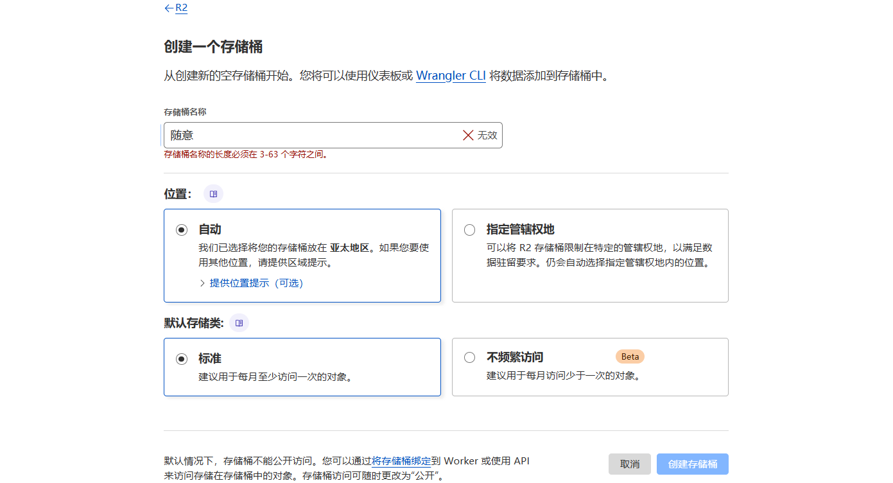
  
  3. 根据需求可选操作：如果**需要启用图像审查，需要开启存储桶的公网访问权限**，有两种开启方式，详见下图。无论你选择哪种方式，都需要记下完整的公网访问链接，格式为`https://xxxx.xxx`
  
     
  
  </details>
  
- **S3** API渠道：在服务提供商处，准备`S3_ACCESS_KEY_ID`、`S3_SECRET_ACCESS_KEY`、`S3_BUCKET_NAME`、`S3_ENDPOINT`等必须参数。（常见服务提供商密钥获取教程参见：[CloudFlare-ImgBed常用S3存储配置教程 – yunsen2025的小窝](https://www.yunsen2025.top/cloudflare-imgbed-s3-she-zhi/)）

</details>

### 3.1.2部署教程

<details>
    <summary>根据自己需求部署在CloudFlare或服务器上</summary>


#### 3.1.2.1部署于Cloudflare

需准备一个**Cloudflare账户**，然后按照以下步骤即可完成部署。

<details>
    <summary>v2.0版本 部署在Cloudflare上的方式</summary>

​    按照以下步骤部署图床在 CloudFlare Pages 上。

1. Fork 本仓库

2. 打开 Cloudflare Dashboard，进入 Pages 管理页面，选择创建项目，选择`连接到 Git 提供程序`

   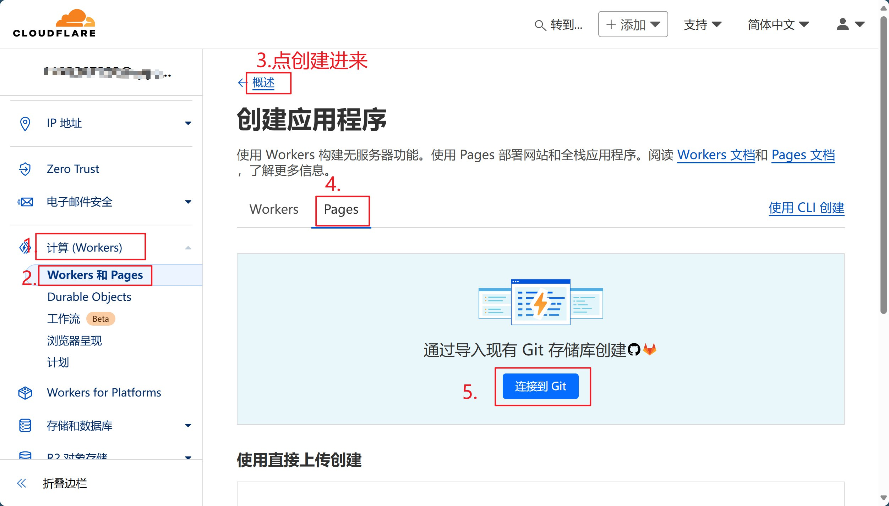

3. 按照页面提示输入项目名称，选择需要连接的 git 仓库，点击`开始设置`

4. 填写`项目名称`，构建命令填写`npm install`，点击`保存并部署`

   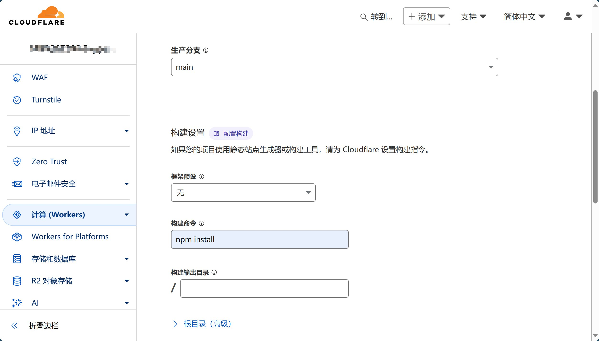

5. **绑定KV数据库**：

   - 创建一个新的KV数据库

     > 
     >
     > 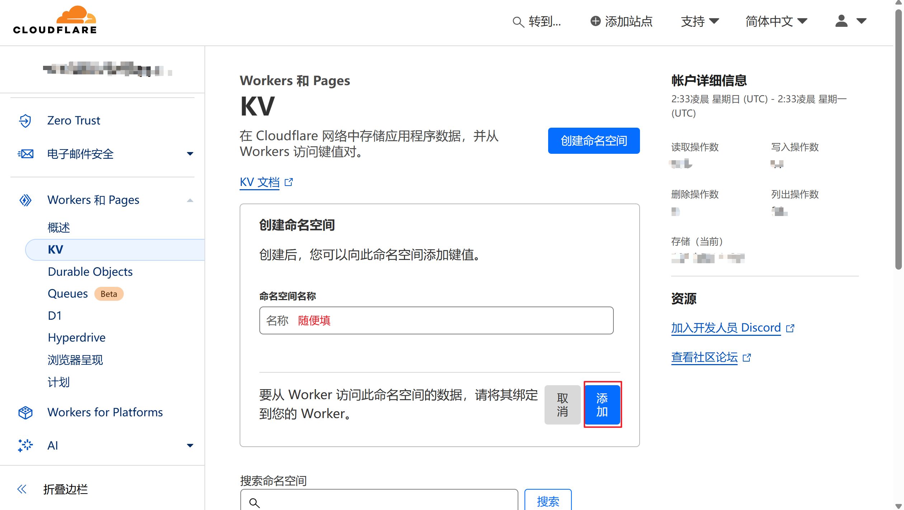

   - 进入项目对应`设置`->`绑定`->`添加`->`KV 命名空间`->`变量名称`，填写`img_url`，`KV命名空间`选择刚才创建好的KV数据库

6. **重试部署**：前往项目管理界面->`部署`->`最新一次部署后面的···`->`重试部署`

7. 根据**所需存储渠道**进行相关设置：

   - `Cloudflare R2`渠道：

     将前面新建的存储桶绑定到项目（和KV绑定地方一样），**名称**为`img_r2`

     > 

     若要启用 R2 渠道的图像审查，请进入 项目管理页面->系统设置->上传设置 处设置 R2 的公开访问链接，值为前面记下的**R2存储桶公网访问链接**

   - `其他渠道`：进入项目管理页面`https://你的域名/systemConfig#upload`，按照页面提示将3.1中获取的渠道参数填写到对应渠道中，保存设置即可

</details>


<details>
    <summary>v1.0版本 部署在Cloudflare上的方式</summary>


依托于CF的强大能力，只需简单几步，即可部署本项目，拥有自己的图床。

1. Fork 本仓库

2. 打开 Cloudflare Dashboard，进入 Pages 管理页面，选择创建项目，选择`连接到 Git 提供程序`

   > 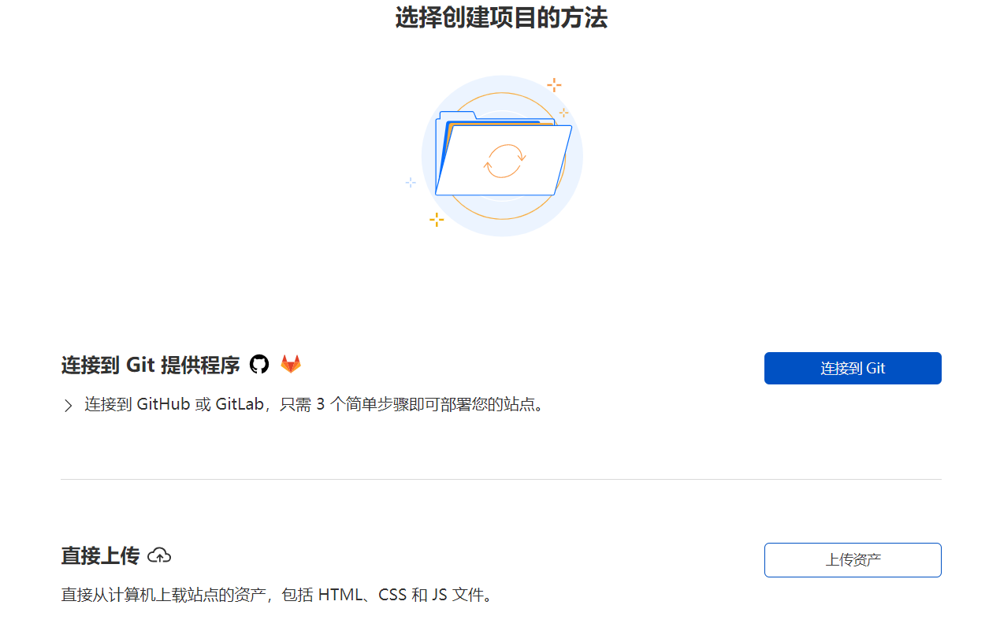

3. 按照页面提示输入项目名称，选择需要连接的 git 仓库，点击`部署站点`

4. 根据**所需存储渠道**进行相关设置：

   - `Telegram 渠道`：将3.1.1中获取的`TG_BOT_TOKEN`和`TG_CHAT_ID`分别添加到环境变量中，对应**环境变量名为`TG_BOT_TOKEN`和`TG_CHAT_ID`**

   - `Cloudflare R2 渠道`：

     - 将前面新建的存储桶绑定到项目，名称为`img_r2`
     
       > 
     
     - 如果后续要开启**图像审查**，需要设置`R2PublicUrl`环境变量，值为前面记下的**R2存储桶公网访问链接**：
     
       > 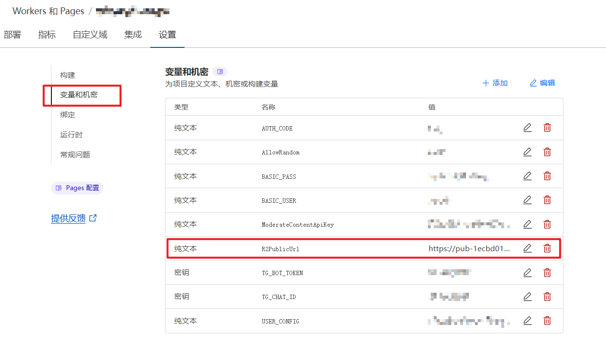
     
   - `S3 渠道`：将前面准备好的`S3_ACCESS_KEY_ID`、`S3_SECRET_ACCESS_KEY`、`S3_BUCKET_NAME`、`S3_ENDPOINT`及其对应值填入环境变量。

3. **绑定KV数据库**：

   - 创建一个新的KV数据库

     > 
     >
     > 

   - 进入项目对应`设置`->`函数`->`KV 命名空间绑定`->`编辑绑定`->`变量名称`，填写`img_url`，KV命名空间选择刚才创建好的KV数据库

3. `重试部署`，此时项目即可正常使用

</details>

#### 3.1.2.2部署于服务器

如果Cloudflare的**有限访问次数**不能满足你的需求，并且你拥有自己的服务器，可以参照[3.1.2.2节](#3.1.2.2部署于服务器)的教程在服务器上模拟Cloudflare的环境，并开放对应的端口访问服务。

注意由于服务器操作系统、硬件版本复杂多样，相关教程**无法确保适合每一位用户**，遇到报错请尽量利用搜索引擎解决，无法解决也可以提issue寻求帮助。

<details>
    <summary>v2.0 部署在服务器上的方式</summary>


1. 安装服务器操作系统对应的`node.js`，经测试`v22.5.1`版本可以正常使用。（安装教程自行search）

2. 切换到项目根目录，运行`npm install`，安装所需依赖。

3. 在项目根目录下新建`wrangler.toml`配置文件，其内容为项目名称，环境变量等。（详情参见官方文档[Configuration - Wrangler (cloudflare.com)](https://developers.cloudflare.com/workers/wrangler/configuration/)）

   > 配置文件样例：
   >
   > ```toml
   > name = "cloudflare-imgbed"
   > compatibility_date = "2024-07-24"
   > ```

4. 在项目根目录下运行`npm run start`，至此，正常情况下项目已经成功部署。项目默认支持通过服务器**本地模拟的R2存储上传**，可通过**管理端系统设置页面**进行其他设置。

   程序默认运行在`8080`端口上，使用`nginx`等服务器反代`127.0.0.1:8080`即可外网访问服务。如需修改端口，可在`package.json`中修改`start`脚本的`port`参数（如下）。

   ```toml
   "scripts": {
       "ci-test": "concurrently --kill-others \"npm start\" \"wait-on http://localhost:8080 && mocha\"",
       "test": "mocha",
       "start": "npx wrangler pages dev ./ --kv \"img_url\" --r2 \"img_r2\" --port 8080 --persist-to ./data"
     }
   ```

   正常启动，控制台输出如下：

   

</details>


<details>
    <summary>v1.0 部署在服务器上的方式</summary>


1. 安装服务器操作系统对应的`node.js`，经测试`v22.5.1`版本可以正常使用。（安装教程自行search）

2. 切换到项目根目录，运行`npm install`，安装所需依赖。

3. 在项目根目录下新建`wrangler.toml`配置文件，其内容为项目名称，环境变量（**包括`TG_BOT_TOKEN`和`TG_CHAT_ID`等参数**）等，可根据后文环境变量配置进行个性化修改。（详情参见官方文档[Configuration - Wrangler (cloudflare.com)](https://developers.cloudflare.com/workers/wrangler/configuration/)）

   > 配置文件样例：
   >
   > ```toml
   > name = "cloudflare-imgbed"
   > compatibility_date = "2024-07-24"
   > 
   > [vars]
   > ModerateContentApiKey = "your_key"
   > AllowRandom = "true"
   > BASIC_USER = "user"
   > BASIC_PASS = "pass"
   > TG_BOT_TOKEN = "your_bot_token"
   > TG_CHAT_ID = "your_bot_id"
   > ```

4. 在项目根目录下运行`npm run start`，至此，正常情况下项目已经成功部署。项目默认支持通过服务器**本地模拟的R2存储上传**。

   程序默认运行在`8080`端口上，使用`nginx`等服务器反代`127.0.0.1:8080`即可外网访问服务。如需修改端口，可在`package.json`中修改`start`脚本的`port`参数（如下）。

   ```toml
   "scripts": {
       "ci-test": "concurrently --kill-others \"npm start\" \"wait-on http://localhost:8080 && mocha\"",
       "test": "mocha",
       "start": "npx wrangler pages dev ./ --kv \"img_url\" --r2 \"img_r2\" --port 8080 --persist-to ./data"
     }
   ```

   正常启动，控制台输出如下：

   
   
   </details>

</details>

### 3.1.3可选配置

<details>
    <summary>v2.0 后台认证、自定义页面、缓存清除等设置</summary>

​    

请前往 管理端->系统设置 界面，按照提示进行设置，如果有不清楚的设置项，可参考下方v1.0版本的设置介绍内容。

</details>


<details>
    <summary>v1.0 后台认证、自定义页面、缓存清除等设置</summary>


#### 3.1.3.1后台管理认证


后台管理页面默认**不设密码**，需按照如下方式**设置认证**：

1. **配置管理员认证**：
   - 项目对应`设置`->`环境变量`->`为生产环境定义变量`->`编辑变量` ，添加`BASIC_USER`作为管理员用户名，`BASIC_PASS`作为管理员登录密码

2. **重新部署项目**：

   - 进入项目对应`部署`->`所有部署`，选择最新的一个，点击后面更多按钮（`···`），选择`重试部署`

   - 部署完成后，访问`http(s)://你的域名/dashboard`即可进入后台管理页面

#### 3.1.3.2图片审查


支持成人内容审查和自动屏蔽，开启步骤如下：

- 前往https://moderatecontent.com/ 注册并获得一个免费的用于审查图像内容的 API key
- 打开 Cloudflare Pages 项目的管理页面，依次点击`设置`，`环境变量`，`添加环境变量`
- 添加一个`变量名称`为`ModerateContentApiKey`，`值`为第一步获得的`API key`，点击`保存`即可

#### 3.1.3.3Web和API上传认证


环境变量增加认证码`AUTH_CODE`，值为你想要设置的认证码。

Web端在登录页面输入你的**认证码**即可登录使用；API端需要在上传链接中后缀`authCode`参数，详见[API文档](#4.2.1上传API)。

#### 3.1.3.4访问域名限制

环境变量增加`ALLOWED_DOMAINS`，多个允许的域名用英文`,`分割，如：`域名.xyz,域名.cloudns.be,域名.pp.ua`

#### 3.1.3.5白名单模式

环境变量增加`WhiteList_Mode`，设置为`true`即可开启白名单模式，仅设置为白名单的图片可被访问。

#### 3.1.3.6自定义配置接口

<details>
    <summary>设置方式</summary>

环境变量增加`USER_CONFIG`，JSON格式（设置时类型选`text`即可），具体字段用途及内容规范见下表。

| 字段名        | 用途                 | 类型          | 内容规范                                                     |
| ------------- | -------------------- | ------------- | ------------------------------------------------------------ |
| loginBkImg    | 自定义登录页面背景   | 列表/字符串   | 1、当字段类型为`列表`时，列表中元素为需要添加到轮播列表中的图片链接（列表中只有一张图时即为固定背景），形如`["1.jpg","2.jpg"]`<br />2、当字段类型为`字符串`时，目前**仅支持**字符串值为`bing`，设置为该值时启用bing随机图片轮播模式。 |
| uploadBkImg   | 自定义上传页面背景   | 列表/字符串   | 同上                                                         |
| bkInterval    | 轮播背景切换时间间隔 | 正整数        | 设置为背景图的轮播时间，默认`3000`，单位`ms`。<br />例如你希望10s切换一次，设置为`10000`即可。 |
| bkOpacity     | 背景图透明度         | (0,1]的浮点数 | 展示的背景图透明度，默认为`1`。<br />如果你觉得显示效果不佳，可以自定义，如`0.8` |
| ownerName     | 页内图床名称         | 字符串        | 只支持`字符串`类型，设置为你自定义的图床名称（默认为`Sanyue`） |
| logoUrl       | 页内图床Logo         | 字符串        | 只支持`字符串`类型，设置为你自定义的图床Logo链接             |
| siteTitle     | 网站标题             | 字符串        | 只支持`字符串`类型，设置为你自定义的网站标题                 |
| siteIcon      | 网站图标             | 字符串        | 只支持`字符串`类型，设置为你自定义的网站图标链接             |
| footerLink    | 页脚传送门链接       | 字符串        | 只支持`字符串`类型，设置为你自定义的传送地址（如个人博客链接） |
| disableFooter | 禁用页脚             | boolean       | 支持`boolean`类型，设为`true`时禁用页脚，默认`false`         |
| urlPrefix     | 全局默认链接前缀     | 字符串        | 只支持`字符串`类型，设置为自定义的全局默认链接前缀，该前缀会覆盖原始默认前缀，但不会覆盖用户自定义的链接前缀 |

> 整体示例：
>
> ```json
> 轮播模式：
> {
> "uploadBkImg": ["https://imgbed.sanyue.site/file/6910f0b5e65ed462c1362.jpg","https://imgbed.sanyue.site/file/a73c97a1e8149114dc750.jpg"],
> "loginBkImg":["https://imgbed.sanyue.site/file/ef803977f35a4ef4c03c2.jpg","https://imgbed.sanyue.site/file/0dbd5add3605a0b2e8994.jpg"],
> "ownerName": "Sanyue",
> "logoUrl": "https://demo-cloudflare-imgbed.pages.dev/random?type=img"
> }
> bing随机图模式：
> {
> "uploadBkImg": "bing",
> "loginBkImg": "bing"
> }
> ```

</details>

#### 3.1.3.7远端遥测

便于开发者进行bug的捕捉和定位，但是**过程中可能收集到访问链接、域名等信息**，如您不愿意泄露类似信息给项目开发者，可在环境变量中添加`disable_telemetry`为`true`来退出遥测。

#### 3.1.3.8随机图API

设置`AllowRandom`环境变量，值为`true`，以从图床中随机获取一张图片，详见[API文档](#4.2.2随机图API)。

#### 3.1.3.9管理端删除、拉黑等操作优化（缓存删除）

正常情况下，因为CloudFlare CDN缓存的存在，在管理端进行删除、拉黑、加白名单等操作不会立即生效，需要等到缓存过期才能生效。

**为了让操作立即生效**，请添加`CF_ZONE_ID`、`CF_EMAIL`、`CF_API_KEY`环境变量，获取方式如下：

<details>
    <summary>操作详情</summary>

`CF_ZONE_ID`:

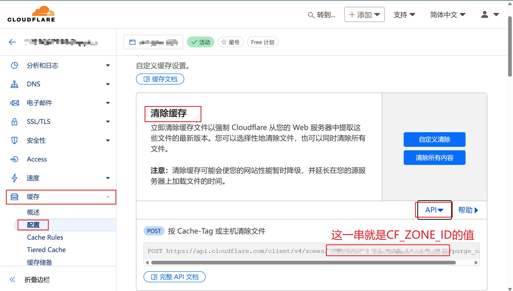

`CF_EMAIL`:即登录CloudFlare账号的邮箱

`CF_API_KEY`:

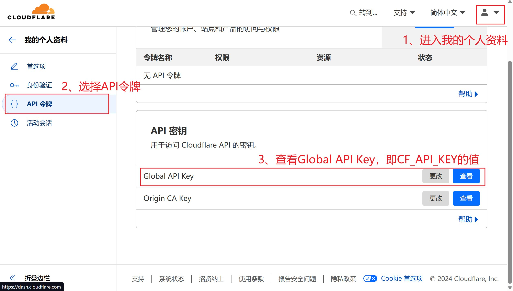

</details>

##### </details>

### 3.1.4其他操作指南

<details>
    <summary>环境变量修改、程序更新等教程</summary>

1. **修改环境变量方式**：


**修改环境变量后需要重新部署才能生效！**


2. **程序更新方式**：


去到 Github 你之前 fork 过的仓库依次选择`Sync fork`->`Update branch`即可，稍等一会，Cloudflare Pages 检测到仓库更新之后便会自动部署最新代码。

如果有新的环境变量需要添加，请根据文档要求进行添加，然后重试部署。

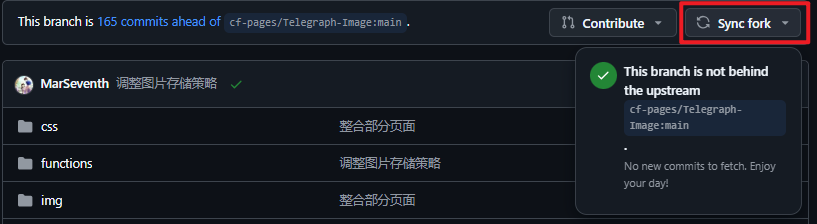

</details>

</details>

## 3.2定制化修改

按照`3.1`步骤部署完成后，前往仓库[MarSeventh/Sanyue-ImgHub](https://github.com/MarSeventh/Sanyue-ImgHub?tab=readme-ov-file)，按照操作说明进行DIY和打包操作，最后将打包好的`/dist`目录中的内容替换到该仓库的根目录下即可（复制+替换）。

# 4.Usage

## 4.1Web端使用


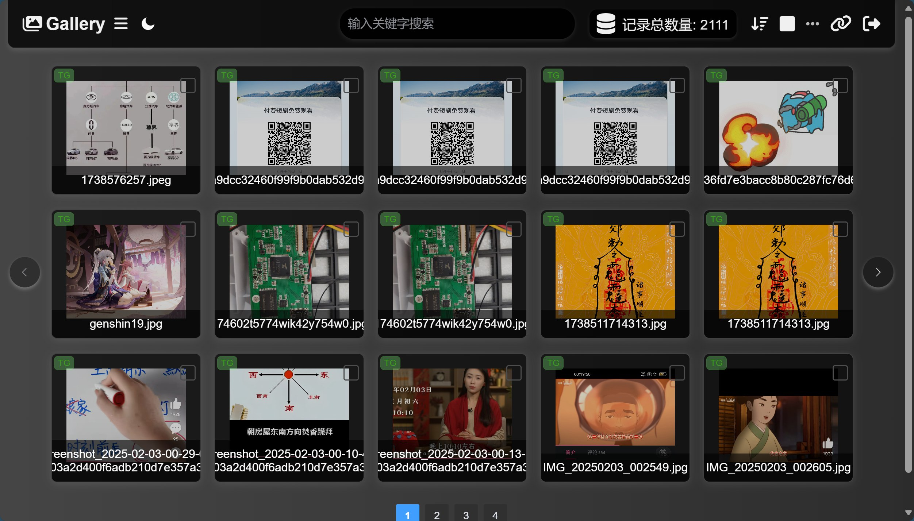

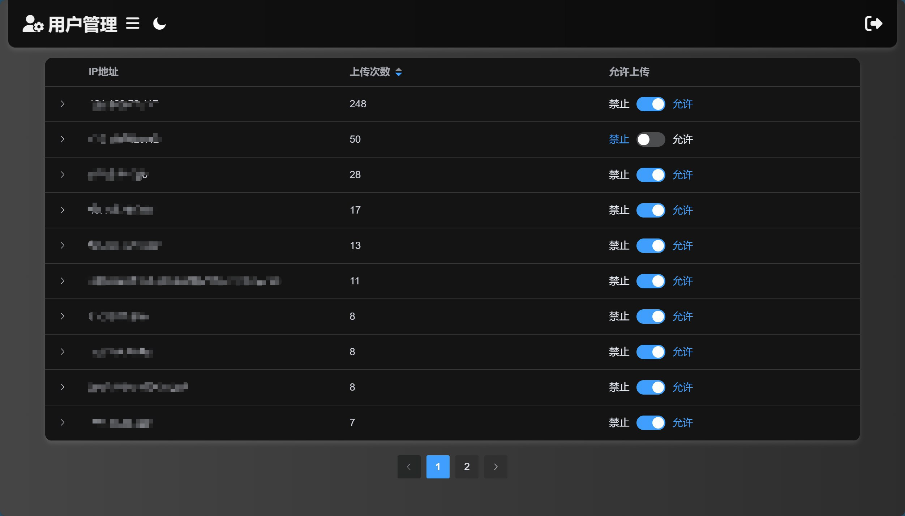

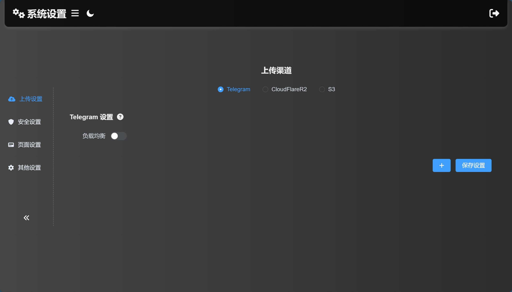

## 4.2API文档

<details>
    <summary>API文档</summary>

### 4.2.1上传API

| 接口名称     | /upload                                                      |
| ------------ | ------------------------------------------------------------ |
| **接口功能** | 上传图片或视频                                               |
| **请求方法** | POST                                                         |
| **请求参数** | **Query参数**：<br />`authCode`: string类型，即为你设置的认证码<br />`serverCompress`: boolean类型，表示是否开启服务端压缩（仅针对图片文件、Telegram上传渠道生效，默认为`true`）<br />`uploadChannel`: string类型，取值为`telegram`和`cfr2`，分别代表telegram bot渠道和Cloudflare R2渠道，默认为`telegram` 渠道<br />`autoRetry`: boolean类型，表示是否开启上传失败自动切换渠道重试，默认开启<br />`uploadNameType`: string类型，表示文件命名方式，可选值为`[default, index, origin, short]`，分别代表默认`前缀_原名`命名、`仅前缀`命名、`仅原名`命名和`短链接`命名法，默认为`default`<br />`returnFormat`:string类型，表示返回链接格式，可选值为`[default, full]`，分别代表默认的`/file/id`格式、完整链接格式<br />**Body参数(application/form-data)**：<br />`file`: file类型，你要上传的文件 |
| **返回响应** | `data[0].src`为获得的图片链接（注意不包含域名，需要自己添加） |

> **请求示例**：
>
> ```bash
> curl --location --request POST 'https://your.domain/upload?authCode=your_authCode' \
> 
> --header 'User-Agent: Apifox/1.0.0 (https://apifox.com)' \
> 
> --form 'file=@"D:\\杂文件\\壁纸\\genshin109.jpg"'
> ```
>
> **响应示例**：
>
> ```json
> [
>  {
>      "src": "/file/738a8aaacf4d88d1590f9.jpg"
>  }
> ]
> ```

### 4.2.2随机图API


| 接口名称     | /random                                                      |
| ------------ | ------------------------------------------------------------ |
| **接口功能** | 从图床中随机返回一张图片的链接（注意会消耗列出次数）         |
| **前置条件** | 设置`AllowRandom`环境变量，值为`true`                        |
| **请求方法** | GET                                                          |
| **请求参数** | **Query参数**：<br />`content`:返回的文件类型，可选值有`[image, video]`，多个使用`,`分隔，默认为`image`<br />`type`: 设为`img`时直接返回图片（此时form不生效）；设为`url`时返回完整url链接；默认返回随机图的文件路径。<br />`form`: 设为`text`时直接返回文本，默认返回json格式内容。 |
| **响应格式** | 1、当`type`为`img`时：<br />返回格式为`image/jpeg`<br />2、当`type`为其他值时：<br />当`form`不是`text`时，返回JSON格式内容，`data.url`为返回的链接/文件路径。<br />否则，直接返回链接/文件路径。 |

> **请求示例**：
>
> ```bash
> curl --location --request GET 'https://your.domain/random' \
> --header 'User-Agent: Apifox/1.0.0 (https://apifox.com)'
> ```
>
> **响应示例**：
>
> ```json
> {
>  "url": "/file/4fab4d423d039b4665a27.jpg"
> }
> ```

</details>

# 5.TODO

## 5.1Add Features💕

<details>
    <summary>功能更新列表</summary>


1. :white_check_mark: ~~增加粘贴图片上传功能~~（2024.7.22已完成）
2. :white_check_mark:~~增加markdown、html等格式链接复制功能~~（2024.7.21已完成）
3. :white_check_mark:~~上传页面增加管理端入口~~（2024.7.21已完成）
4. :memo:增加用户个性化配置接口
   - ~~登录页面和上传页面背景图自定义~~（2024.8.25已完成）
   - ~~图床名称和Logo自定义~~（2024.8.26已完成）
   - ~~网站标题和Icon自定义~~（2024.8.26已完成）
   - ~~背景切换时间自定义~~（2024.9.11已完成）
   - ~~背景透明度支持自定义~~（2024.9.12已完成）
   - ~~页脚自定义传送门~~（2024.10.20已完成）
   - ~~全局自定义链接前缀~~（2024.12.27已完成）
   - ~~可隐藏页脚~~（2025.2.4已完成）
5. :white_check_mark:~~增加随机图API~~（2024.7.25已完成）
6. :white_check_mark:~~完善多格式链接展示形式，增加ubb格式链接支持~~（2024.8.21已完成）
7. :white_check_mark:~~完善登录逻辑，后端增加认证码校验接口~~（2024.8.21已完成）
8. :white_check_mark:~~支持URL粘贴上传~~（2024.8.23已完成）
9. :white_check_mark:~~支持大于5MB的图片上传前自动压缩~~（2024.8.26已完成）
10. :white_check_mark:~~上传页面右下角工具栏样式重构，支持上传页自定义压缩（上传前+存储端）~~（2024.9.28已完成）
11. :white_check_mark:~~重构管理端，认证+显示效果优化，增加图片详情页~~（2024.12.20已完成）
12. :white_check_mark:~~管理端增加访问量统计，IP记录、IP黑名单、上传IP黑名单等~~（2024.12.20已支持上传ip黑名单，访问记录由于对KV读写消耗太大，暂时搁置）
13. :white_check_mark:~~上传页面点击链接，自动复制到剪切板~~(2024.9.27已完成)
14. :white_check_mark:~~上传设置记忆（上传方式、链接格式等）~~（2024.9.27已完成，**两种上传方式合并**）
15. :white_check_mark:~~若未设置密码，无需跳转进入登录页~~（2024.9.27已完成）
16. :white_check_mark:~~增加仅删除上传成功图片、上传失败图片重试~~（2024.9.28已完成）
17. :white_check_mark:~~优化粘贴上传时文件命名方法~~（2024.9.26已完成）
18. :white_check_mark:~~增加对R2 bucket的支持~~（2024.11.5已完成）
19. :white_check_mark:~~管理端增加批量黑名单、白名单功能~~（2024.12.14已完成）
20. :white_check_mark:~~Telegram Channel渠道上传文件记录机器人和频道数据，便于迁移和备份~~（2024.12.4已完成）
21. :white_check_mark:~~支持自定义命名方式（仅原名 or 仅随机前缀 or 默认的随机前缀\_原名）~~（2024.12.4已完成）
22. :white_check_mark:~~支持上传失败自动切换其他渠道尝试~~（2024.12.12已完成）
23. :white_check_mark:~~后端list接口实现分页功能~~（2024.2.5已完成）
24. :white_check_mark:~~支持自定义链接前缀~~（2024.12.4已完成）
25. :memo:对接alist，或实现webdav（评估中）
26. :white_check_mark:~~文件详情增加文件大小记录~~（2024.12.10已完成）
27. :white_check_mark:~~支持管理员自定义全局默认链接前缀~~（2025.2.1已完成）
28. :white_check_mark:~~开放更多文件格式~~（2024.12.9已完成）
29. :white_check_mark:~~进行删除、加入白名单、加入黑名单等操作时，自动清除CF CDN缓存，避免延迟生效~~（2024.12.11已完成）
30. :white_check_mark:~~管理端批量选择时，记录用户选择的顺序~~（2024.12.20已完成）
31. :memo:上传图片支持自定义上传路径，支持相册功能（评估中）
32. :white_check_mark:~~支持多个 Telegram Bot Token 负载均衡~~（2025.2.4已完成）
33. :white_check_mark:~~管理端提供详细的设置信息和设置方式引导~~（2025.2.5已完成）
34. :white_check_mark:~~Logo焕新、登录页面优化、设置提示项等多项展示效果优化~~（2025.2.2已完成）
35. :white_check_mark:~~接入S3 API渠道~~（2024.2.3已完成）
36. :white_check_mark:~~支持短链接命名方式~~（2025.2.1已完成）
37. :white_check_mark:~~支持深色模式~~（2025.1.11已完成）
38. :hourglass_flowing_sand:支持KV备份恢复功能
39. :white_check_mark:~~页脚可自定义隐藏~~（2025.2.4已完成）
40. :hourglass_flowing_sand:搜索功能增强

</details>

## 5.2Fix Bugs👻

<details>
    <summary>Bug修复列表</summary>


1. :white_check_mark:~~修复API上传无法直接展示在后台的问题~~（2024.7.25已修复）
1. :white_check_mark:~~由于telegra.ph关闭上传，迁移至TG频道上传~~（2024.9.7已修复）
1. :white_check_mark:~~修复未设管理员认证时管理端无限刷新的问题~~（2024.9.9已修复）
1. :white_check_mark:~~修复部分视频无法预览播放的问题~~（经测试，暂定为文件自身存在问题，暂无法修复）
1. :hourglass_flowing_sand:增加新的图片审查渠道
1. :white_check_mark:~~R2渠道在管理端删除时，存储桶同步删除~~（2024.12.4已修复）
1. :white_check_mark:~~读取文件响应头增加允许跨域头`access-control-allow-origin: *`~~（2024.12.9已修复）
1. :white_check_mark:~~上传界面加入访问限制白名单~~（2024.12.11已修复）

</details>

# 6.Q&A

<details>
    <summary>常见问题解答</summary>

## 6.1未设置`ALLOWED_DOMAINS`，但无法跨域访问？

- 请检查你的cloudflare防火墙设置（例如hotlink保护是否开启）
- 参见[Issue #8](https://github.com/MarSeventh/CloudFlare-ImgBed/issues/8)

## 6.2如何通过PicGo上传？

- PicGo插件设置中搜索`web-uploader`，安装可自定义前缀的版本，如图：

  

- 打开`图床设置`->`自定义Web图床`->`Default`，然后按照下图方式配置，注意API地址和自定义图片URL前缀按照自己的域名进行修改。（**如果设置了`AUTH_CODE`，一定以`?authCode=your_authCode`的方式添加到API地址后面**）：

  

- 设置完成，确定即可使用PicGo上传到自建的图床。

## 6.3上传失败怎么办？

- 是否正确配置`TG_BOT_TOKEN`、`TG_CHAT_ID`等环境变量
- 是否给机器人管理员配置**足够的权限**
- 是否**正确绑定KV数据库**
- 是否更新至**最新版**
- 前往issues寻找相似问题

## 6.4`TG_CHAT_ID`前面有没有`-`

- 注意看图，前面有`-`

## 6.5进入后台页面加载不出记录或图片

- 网络问题，尝试刷新页面

## 6.6后台进行删除、拉黑等操作时不能立即生效

- 与CDN缓存有关
- 详见[[重要\]关于CDN缓存的说明（删除、拉黑等操作延迟生效解决方案） · Issue #123 · MarSeventh/CloudFlare-ImgBed (github.com)](https://github.com/MarSeventh/CloudFlare-ImgBed/issues/123)

</details>

# 7.Tips

- 前端开源，参见[MarSeventh/Sanyue-ImgHub](https://github.com/MarSeventh/Sanyue-ImgHub)项目。

- **赞助**：项目维护不易，喜欢本项目的话，可以作者大大一点小小的鼓励哦，您的每一份支持都是我前进的动力\~ 

  <a href="https://afdian.com/a/marseventh"></a>
  
- **Sponsors**：感谢以下赞助者对本项目的支持！

  <a href="https://afdian.com/a/nothin">
        
      </a> <a href="https://afdian.com/u/1acef0be02d911ee90695254001e7c00">
        </a><a href="https://afdian.com/u/412189a0284911eca59f52540025c377">
        </a>

# 8.Star History

[](https://star-history.com/#MarSeventh/CloudFlare-ImgBed&MarSeventh/Sanyue-ImgHub&Date)

**如果觉得项目不错希望您能给个免费的star✨✨✨，非常感谢！**
