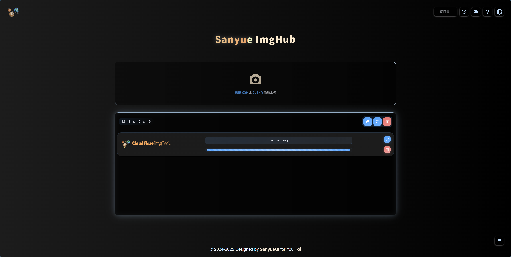
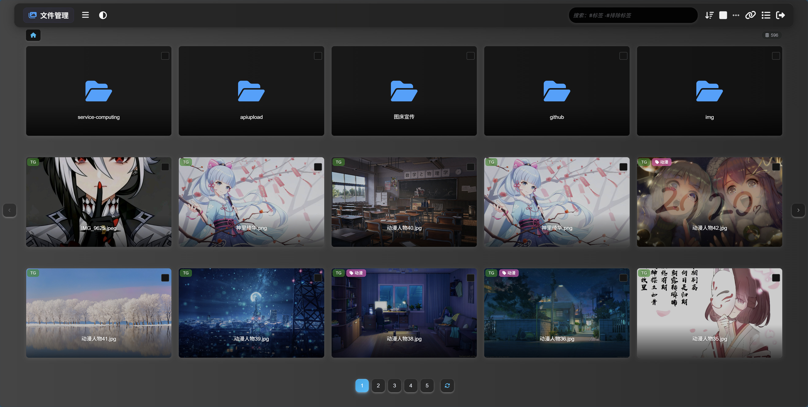
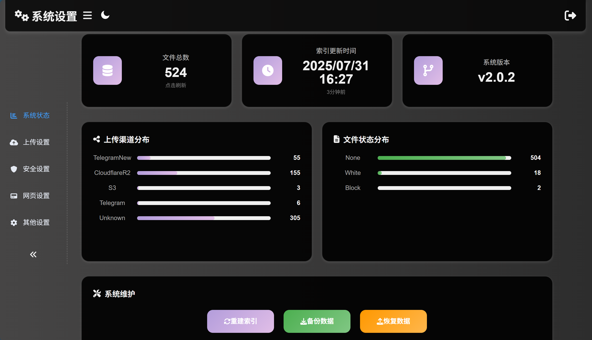
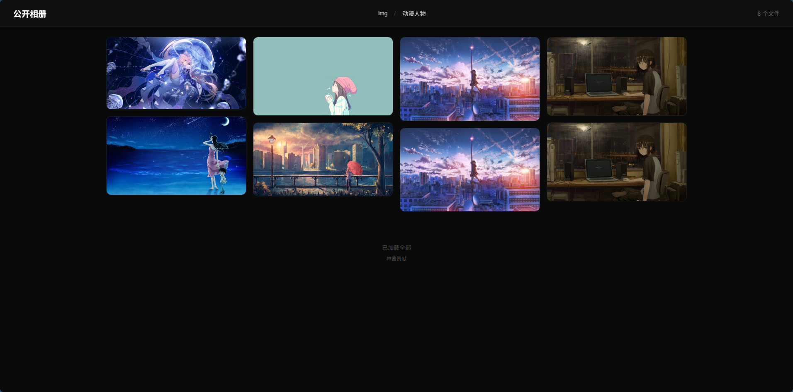

    
    
<em>🗂️开源文件托管解决方案，支持 Docker 和无服务器部署，支持 Telegram、Discord、Cloudflare R2、S3、Huggingface 等多种存储渠道，支持 WebDAV 协议和多种 RESTful API</em>

    

        <a href="https://github.com/MarSeventh/CloudFlare-ImgBed/blob/main/README.md">简体中文</a> | <a href="https://github.com/MarSeventh/CloudFlare-ImgBed/blob/main/README_en.md">English</a> | <a href="https://cfbed.sanyue.de">官方网站</a>
    

    

        
        
        
        
        
        
        
    

    

      
    

---

> [!IMPORTANT]
>
> **v2.0 版本升级注意事项请查看公告！**

    
公告

## 置顶

1. 部署使用出现问题，请先仔细查阅文档、常见问题解答以及已有issues。

2. **注意**：本仓库为[Telegraph-Image](https://github.com/cf-pages/Telegraph-Image)项目的重制版，如果你觉得本项目不错，在支持本项目的同时，也请支持原项目。

## 2025.2.6  V2.0 版本升级注意事项

> v2.0 版已发布，相较于 v1.0 版本进行了大量改动和优化，但 beta 版本可能存在潜在不稳定性，若您追求稳定，可选择暂缓更新。
>
> 由于**构建命令发生了变化**，此次更新需要您**手动进行**，请按照以下步骤进行操作：
>
> - 同步fork的仓库至最新版（若已自动同步可忽略）
>
> - 前往 pages 管理页面，进入`设置`->`构建`，编辑`构建配置`，在`构建命令`处填写`npm install`
>
> - 新版本所有设置项已**迁移至 管理端->系统设置 界面**，原则上无需再通过环境变量的方式进行设置，通过系统设置界面进行的设置将**覆盖掉**环境变量中的设置，但为了保证 **Telegram渠道的图片** 能够与旧版本相兼容，**若您之前设置了 Telegram 渠道相关的环境变量，请将其保留！**
>
> - 确保上述设置完成无误后，前往 pages 管理页面，进入`部署`，对最后一次不成功的部署进行`重试操作`

## 关于切换到 Telegram 渠道的通知

> 由于telegraph图床被滥用，该项目上传渠道已切换至Telegram Channel，请**更新至最新版（更新方式见第3.1章最后一节）**，按照文档中的部署要求**设置`TG_BOT_TOKEN`和`TG_CHAT_ID`**，否则将无法正常使用上传功能。
>
> 此外，目前**KV数据库为必须配置**，如果以前未配置请按照文档说明配置。
>
> 出现问题，请先查看第5节常见问题Q&A部分。

# 1. Introduction

免费文件托管解决方案，具有**上传**、**管理**、**读取**、**删除**等全链路功能，覆盖文件全生命周期，支持**鉴权**、**目录**、**图片审查**、**随机图**等各项特性（详见[功能文档](https://cfbed.sanyue.de/guide/features.html)）。

# 2. [Document](https://cfbed.sanyue.de)

提供详细的部署文档、功能文档、开发计划、更新日志、常见问题解答等，帮助您快速上手。

# 3. Demo

**演示站点**：[CloudFlare ImgBed](https://cfbed.1314883.xyz/) 访问密码：`cfbed`

    
其他页面效果展示

# 4. Tips

- **前端开源**：参见[MarSeventh/Sanyue-ImgHub](https://github.com/MarSeventh/Sanyue-ImgHub)项目。

- **生态建设**：欢迎社区参与生态建设，欢迎提交 PR 或者 Issue，优质内容参见[官网生态建设页面](https://cfbed.sanyue.de/about/ecosystem.html)。

- **赞助**：项目维护不易，喜欢本项目的话，可以作者大大一点小小的鼓励哦，您的每一份支持都是我前进的动力\~ 

  
  
- **Sponsors**：感谢以下赞助者对本项目的支持！

  
  
- **Contributors**：感谢以下贡献者对本项目的无私贡献！

  

# 5. Star History

**如果觉得项目不错希望您能给个免费的star✨✨✨，非常感谢！**

# 6. Special Sponsors

- **[CloudFlare](https://www.cloudflare.com) & [EdgeOne](https://edgeone.ai/?from=github)**：提供CDN加速和安全保护服务

   

- **[速维云](https://www.svyun.com/recommend/AELZ0UeMz8K11Zg7pEXC)**：提供云计算服务资源支持

