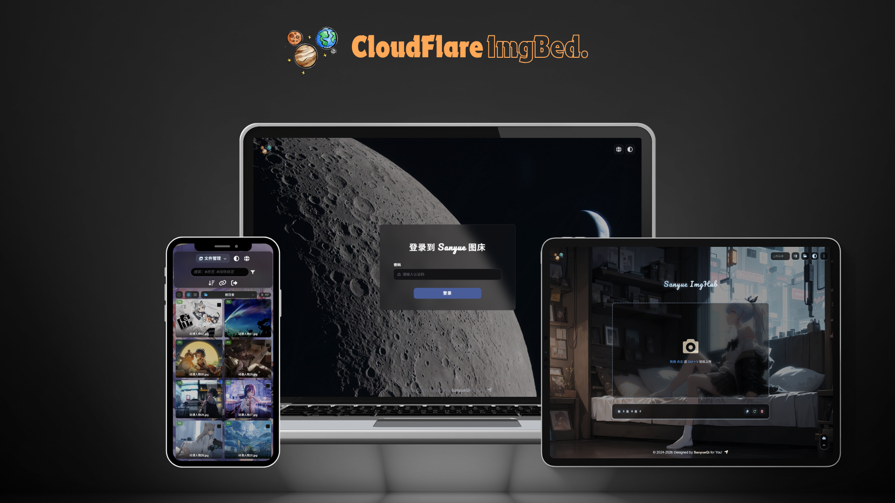
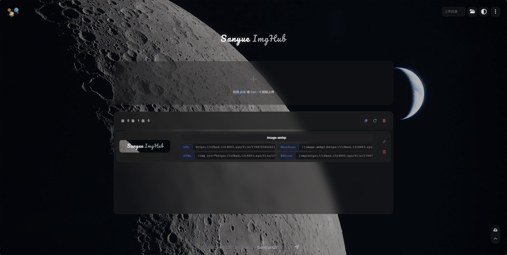
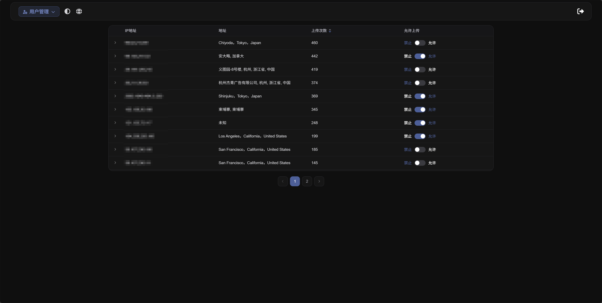
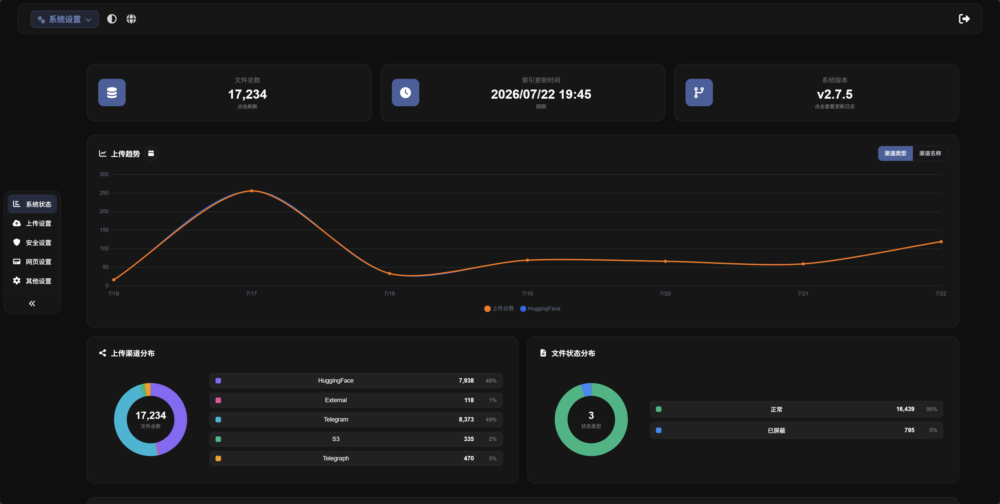

<div align="center">
    <a href="https://github.com/MarSeventh/CloudFlare-ImgBed"></a>
    <p><em>🗂️Open-source file hosting solution, supporting Docker and serverless deployment, supporting multiple storage channels such as Telegram, Discord, Cloudflare R2, S3, Huggingface, WebDAV, etc., providing RESTful APIs and WebDAV support.</em></p>
    <p>
        <a href="https://github.com/MarSeventh/CloudFlare-ImgBed/blob/main/README_zh.md">简体中文</a> | <a href="https://github.com/MarSeventh/CloudFlare-ImgBed/blob/main/README.md">English</a> | <a
        href="https://cfbed.sanyue.de/en">Official Website</a>
    </p>
    <p align="center">
        <a href="https://github.com/MarSeventh/CloudFlare-ImgBed/blob/main/LICENSE"></a>&nbsp;<a href="https://github.com/MarSeventh/CloudFlare-ImgBed/releases"></a>&nbsp;<a href="https://github.com/MarSeventh/CloudFlare-ImgBed/releases"></a>&nbsp;<a href="https://hub.docker.com/r/marseventh/cloudflare-imgbed"></a>&nbsp;<a href="https://github.com/MarSeventh/CloudFlare-ImgBed/issues"></a>&nbsp;<a href="https://github.com/MarSeventh/CloudFlare-ImgBed/stargazers"></a>&nbsp;<a href="https://github.com/MarSeventh/CloudFlare-ImgBed/network/members"></a>
    </p>
    <p align="center">
      <a href="https://trendshift.io/repositories/14324" target="_blank">
        
      </a>
    </p>
</div>


---

> [!IMPORTANT]
>
> **Please check the announcement for upgrade notes on version 2.0!**


<details>
    <summary>Announcement</summary>

## Pinned

1. If you encounter issues during deployment or usage, please carefully read the documentation, FAQ, and existing issues first.
2. **Note**: This repository is a remake of the [Telegraph-Image](https://github.com/cf-pages/Telegraph-Image) project. If you like this project, please support the original one as well.

## V2.7.1+ Cloudflare Pages Build Output Directory Change

> Starting from v2.7.1, frontend build output has been moved to the `frontend-dist` directory. **Cloudflare Pages users** need to manually update the build configuration:
>
> 1. Go to Cloudflare Dashboard → Your Pages project → `Settings` → `Build`
> 2. Edit `Build configuration`, change `Build output directory` from `/` to `/frontend-dist`
> 3. Save and redeploy
>
> Docker and Workers users are not affected.

## 2026.3.4 V2.6.2 Docker Image Rebuild Notice

> The Docker image has been rebuilt in this release, involving changes to the base image, directory structure, and database, bringing optimizations in concurrency, memory management, and more. To ensure data safety, please **back up your data before upgrading**.
>
> ### Before Upgrading: Back Up Data
>
> 1. Back up data: Download the backup file from the admin panel (if you were using local R2 storage, you need to download and re-upload all files)
> 2. Back up the data folder
>
> ### Upgrade Steps
>
> 1. Pull the latest image:
>
>    ```bash
>    docker compose pull
>    ```
>
> 2. Start the container with the new image:
>
>    ```bash
>    docker compose up -d
>    ```
>
> 3. Verify the container is running properly:
>
>    ```bash
>    docker compose logs -f
>    ```
>
>    Once you confirm there are no errors in the logs, you're good to go.
>
> 4. Restore data: Restore all data from the admin panel (R2 files from the old version need to be re-uploaded)
> 
> ### Rollback to Previous Version
>
> If something goes wrong after upgrading, follow these steps to roll back:
>
> 1. Stop the container:
>
>    ```bash
>    docker compose down
>    ```
>
> 2. Pull the previous image version:
>
>    ```bash
>    # amd64
>    docker pull marseventh/cloudflare-imgbed@sha256:896dc1b79883
>    # arm
>    docker pull marseventh/cloudflare-imgbed@sha256:b5442ccc198c
>    ```
>
>    Also update the `image` field in `docker-compose.yml` to the old version tag, then restart:
>
>    ```bash
>    docker compose up -d
>    ```
>
> **Notes**:
> - Make sure the backup is complete before upgrading, and back up the data folder if necessary
> - If you have a custom `docker-compose.yml` (e.g., custom ports, environment variables), preserve those settings during the upgrade
> - For issues, please check the documentation and existing issues first, or submit a new issue

## 2025.2.6 Version 2.0 Upgrade Notes

> The v2.0 version has been released, with many changes and optimizations compared to v1.0. However, the beta version may have potential instability. If you prefer stability, you may delay updating.
>
> Due to **changes in the build command**, this update requires **manual operation**. Please follow these steps:
>
> - Sync your forked repository to the latest version (ignore if already synced automatically)
> - Go to the Pages management page, enter `Settings` -> `Build`, edit the `Build configuration`, and set the `Build command` to `npm install`
> - All new version settings have been **migrated to the Admin Panel -> System Settings** interface, so generally no need to configure environment variables anymore. Settings made in the system settings interface will **override** environment variable settings. However, to ensure compatibility of images uploaded via the Telegram channel with the old version, **please keep any previously set Telegram-related environment variables!**
> - After confirming the above settings are correct, go to the Pages management page, enter `Deployments`, and `Retry` the last failed deployment.

## Notification About Switching to Telegram Channel

> Due to abuse of the telegraph image hosting, the upload channel has switched to Telegram Channel. Please **update to the latest version (see the last section of chapter 3.1 for update instructions)** and set `TG_BOT_TOKEN` and `TG_CHAT_ID` according to the deployment requirements in the documentation, otherwise upload functionality will not work.
>
> Also, the **KV database is now mandatory**; if not configured before, please configure it as per the documentation.
>
> For issues, please check section 5 FAQ first.

</details>


# 1. Introduction

Free file hosting solution with full lifecycle features including **upload**, **management**, **read**, and **delete**, supporting **authentication**, **directories**, **image moderation**, **random images**, and other features (see [Feature Docs](https://cfbed.sanyue.de/en/guide/features.html) for details).



# 2. [Document](https://cfbed.sanyue.de/en)

Provides detailed deployment documentation, feature docs, development plans, update logs, FAQ, and more to help you get started quickly.

[](https://cfbed.sanyue.de/en/guide/update-log.html)

# 3. Demo

**Demo Address**: [CloudFlare ImgBed](https://cfbed.1314883.xyz/) Access Password: `cfbed`


<details>
    <summary>Other page screenshots</summary>









</details>

# 4. Tips

- Frontend is open source, see [MarSeventh/Sanyue-ImgHub](https://github.com/MarSeventh/Sanyue-ImgHub).

- Desktop software is open source, see [MarSeventh/satellite](https://github.com/MarSeventh/satellite).

- **Ecosystem**: We welcome community participation in the ecosystem construction. Feel free to submit PRs or Issues, and high-quality content can be found on the [official ecosystem page](https://cfbed.sanyue.de/en/about/ecosystem.html).

- **Sponsor**: Maintaining the project is not easy. If you like it, please support the author. Your support is the motivation to keep going~

  <a href="https://afdian.com/a/marseventh"></a>&nbsp;&nbsp;<a href="readme/weixin-reward.png" target="_blank"></a>&nbsp;&nbsp;<a href="readme/alipay-reward.png" target="_blank"></a>
  
- **Sponsors**: Thanks to the following sponsors for supporting this project!

  [](https://afdian.com/a/marseventh)
  
- **Contributors**: Thanks to the following contributors for their selfless contributions!

  [](https://github.com/MarSeventh/CloudFlare-ImgBed/graphs/contributors)

# 5. Star History

**If you like the project, please give a free star✨✨✨, thank you very much!**

[](https://star-history.com/#MarSeventh/CloudFlare-ImgBed&MarSeventh/Sanyue-ImgHub&Date)

# 6. Special Sponsors

- **[CloudFlare](https://www.cloudflare.com/) & [EdgeOne](https://edgeone.ai/?from=github)**：Provides CDN acceleration, and security protection

  <a href="https://www.cloudflare.com"></a> <a href="https://edgeone.ai/?from=github"></a>

- **[Svyun](https://www.svyun.com/recommend/AELZ0UeMz8K11Zg7pEXC)**：Provides cloud computing resources support

- **[Linux DO](https://linux.do/)**: Genuine · Friendly · United · Expert
