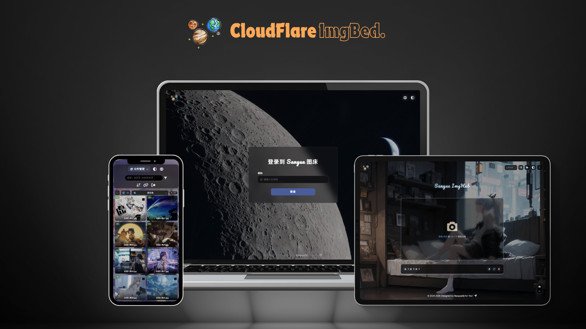
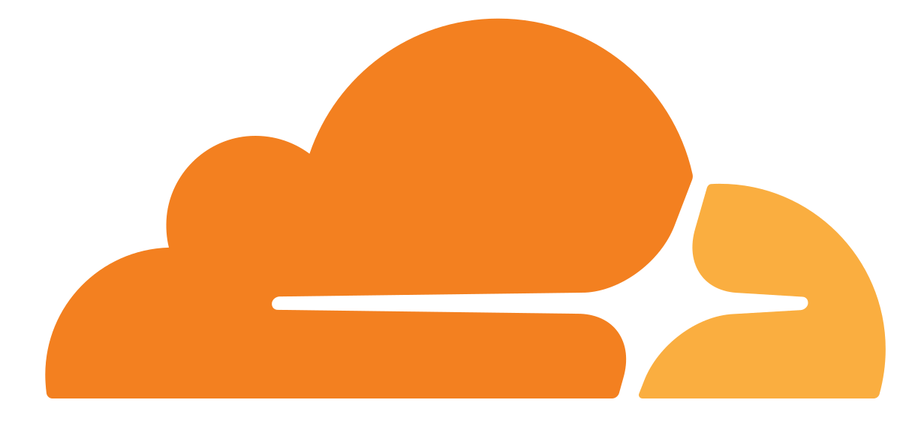
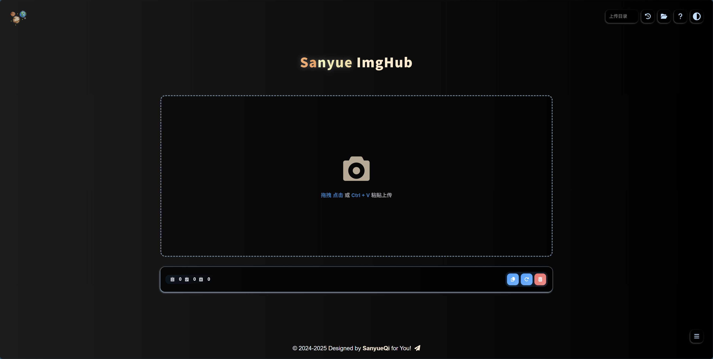
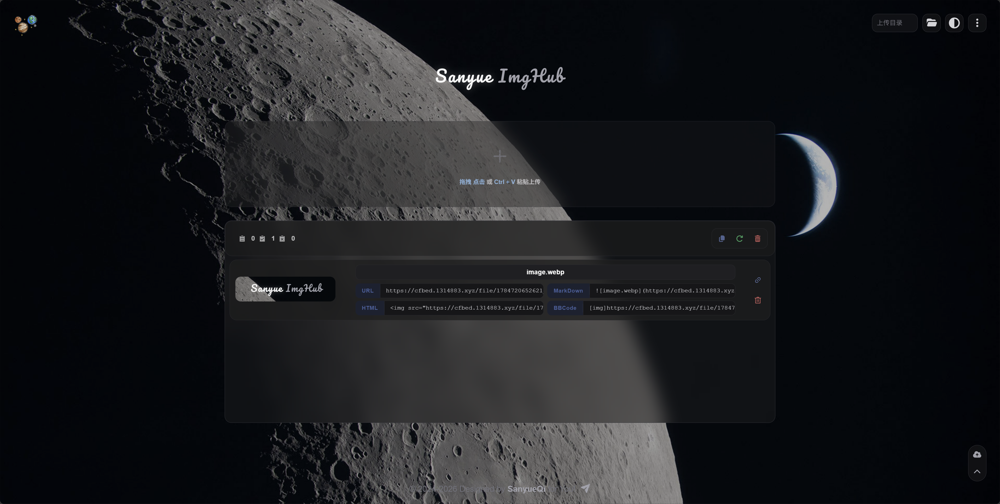
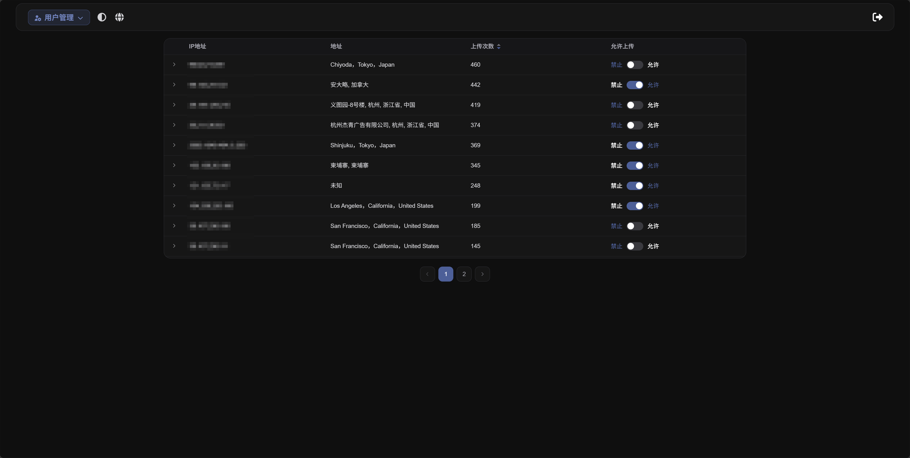
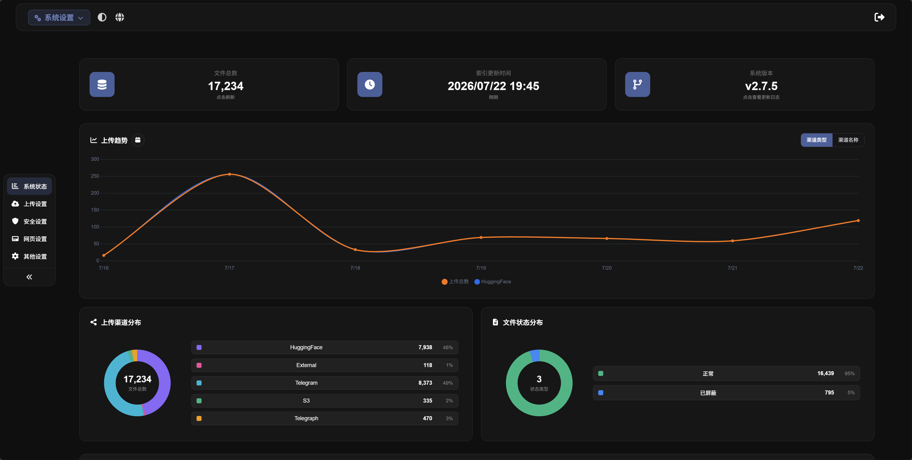

    
    
<em>🗂️ Beyond image hosting: an all-in-one, open-source file management hub.</em>

    

        <a href="https://github.com/MarSeventh/CloudFlare-ImgBed/blob/main/README_zh.md">简体中文</a> | <a href="https://github.com/MarSeventh/CloudFlare-ImgBed/blob/main/README.md">English</a> | <a href="https://cfbed.sanyue.de/en">Official Website</a>
    

    

        
        
        
        
        
        
        
    

    

        
        
    

---

> [!IMPORTANT]
>
> **If you encounter issues, please check the [announcement](https://github.com/MarSeventh/CloudFlare-ImgBed/discussions/categories/announcements) first. Important notifications and non-compatible updates will be explained in the announcement!**

# 1. 💡 Introduction

CloudFlare ImgBed is a self-hosted image and file hosting solution for Docker and serverless environments, bringing **Telegram**, **Discord**, **Cloudflare R2**, **S3-compatible storage**, **Hugging Face**, **WebDAV**, and more into one management interface. It provides file management, authentication, directory organization, content moderation, a RESTful API, and WebDAV for personal image hosting, website asset management, and lightweight file distribution. **[View all features →](https://cfbed.sanyue.de/en/guide/features.html)**

## 🤝 Partners

<table width="100%">
  <tr>
    <td align="center" width="20%">
      <strong><a href="https://www.cloudflare.com/">Cloudflare</a></strong>
    </td>
    <td align="center" width="20%">
      <strong><a href="https://edgeone.ai/?from=github">EdgeOne</a></strong>
    </td>
    <td align="center" width="20%">
      <strong><a href="https://www.hncloud.com/activity/activity_2026summer.html?k=MarSeventh">HuaNa Cloud</a></strong>
    </td>
    <td align="center" width="20%">
      <strong><a href="https://www.svyun.com/recommend/AELZ0UeMz8K11Zg7pEXC">SuWei Cloud</a></strong>
    </td>
    <td align="center" width="20%">
      <strong><a href="https://linux.do/t/topic/2578561">Linux DO</a></strong>
    </td>
  </tr>
  <tr>
    <td align="center"></td>
    <td align="center"></td>
    <td align="center"></td>
    <td align="center"></td>
    <td align="center"></td>
  </tr>
  <tr>
    <td align="center">Provides CDN acceleration and security protection</td>
    <td align="center">Provides CDN acceleration and security protection</td>
    <td align="center">Provides stable and high-quality cloud computing resources</td>
    <td align="center">Provides stable and high-quality cloud computing resources</td>
    <td align="center">Provides community support</td>
  </tr>
</table>

# 2. 🖥️ Demo

**Demo Address**: [CloudFlare ImgBed](https://cfbed.1314883.xyz/) · **Access Password**: `cfbed`

    
Other page screenshots

<table>
  <tr>
    <td align="center" width="50%">
      <strong>Login Page</strong> 
      
    </td>
    <td align="center" width="50%">
      <strong>Upload Progress</strong> 
      
    </td>
  </tr>
  <tr>
    <td align="center" width="50%">
      <strong>File Management</strong> 
      
    </td>
    <td align="center" width="50%">
      <strong>User Management</strong> 
      
    </td>
  </tr>
  <tr>
    <td align="center" width="50%">
      <strong>Status Page</strong> 
      
    </td>
    <td align="center" width="50%">
      <strong>Public Gallery</strong> 
      
    </td>
  </tr>
</table>

# 3. 📚 Documentation & Updates

## 📖 Documentation

The documentation covers deployment, storage configuration, feature usage, RESTful API integration, WebDAV, version upgrades, and troubleshooting. Whether you are deploying the project for the first time or maintaining an existing instance, you can find the relevant instructions here.

**[Read the full documentation →](https://cfbed.sanyue.de/en)**

## 📝 Changelog

Follow the latest features, bug fixes, compatibility changes, and upgrade notes.

# 4. 🌱 Ecosystem

An open-source ecosystem grows through community support. Visit the [CloudFlare ImgBed Ecosystem](https://cfbed.sanyue.de/en/about/ecosystem.html) page to explore the following resources and more:

- **Plugin Extensions**: Browser extensions, integrations for Typecho, WordPress, and Obsidian, OpenList drivers, and more.
- **Companion Applications**: Desktop clients, bot tools, and more.
- **AI Agent Applications**: Official project skills and related tools.
- **Tutorials and Guides**: High-quality videos and articles from content creators.

Discover useful plugins, applications, and tutorials, or share your own work with the community. See the [Ecosystem Call for Contributions](https://github.com/MarSeventh/CloudFlare-ImgBed/discussions/606) for submission guidelines. We look forward to your participation!

# 5. 💝 Support & Sponsors

## ☕ Support the Project

Maintaining an open source project takes time and effort. If CloudFlare ImgBed has helped you, consider supporting its continued development.

  
  &nbsp;&nbsp;
  

## 💖 Sponsors

Thank you to every sponsor who supports this project! Your support helps sustain ongoing maintenance and drives the continued improvement of CloudFlare ImgBed.

# 6. 👥 Community

## 🧑‍💻 Contributors

Thank you to everyone who has contributed code, documentation, ideas, and feedback!

## ⭐ Star History

**If you find the project useful, please consider giving it a Star ⭐. Thank you for your support!**

<a href="https://github.com/MarSeventh/CloudFlare-ImgBed">
 <picture>
   <source media="(prefers-color-scheme: dark)" srcset="https://marseventh.github.io/CloudFlare-ImgBed/star-history-dark.svg" />
   <source media="(prefers-color-scheme: light)" srcset="https://marseventh.github.io/CloudFlare-ImgBed/star-history-light.svg" />
   
 </picture>
</a>

# 7. ⚖️ License & Related Projects

## 📄 License

> [!IMPORTANT]
> This project is licensed under the [MIT License](LICENSE). You may use, modify, and distribute it, provided that the original copyright and license notices are retained in all copies or substantial portions of the software.

## 🔗 Related Open Source Projects

- **Web frontend**: [MarSeventh/Sanyue-ImgHub](https://github.com/MarSeventh/Sanyue-ImgHub)
- **Desktop client**: [MarSeventh/satellite](https://github.com/MarSeventh/satellite)
- **Upstream project**: [cf-pages/Telegraph-Image](https://github.com/cf-pages/Telegraph-Image)

CloudFlare ImgBed evolved from Telegraph-Image. Thanks to its original authors and contributors.
