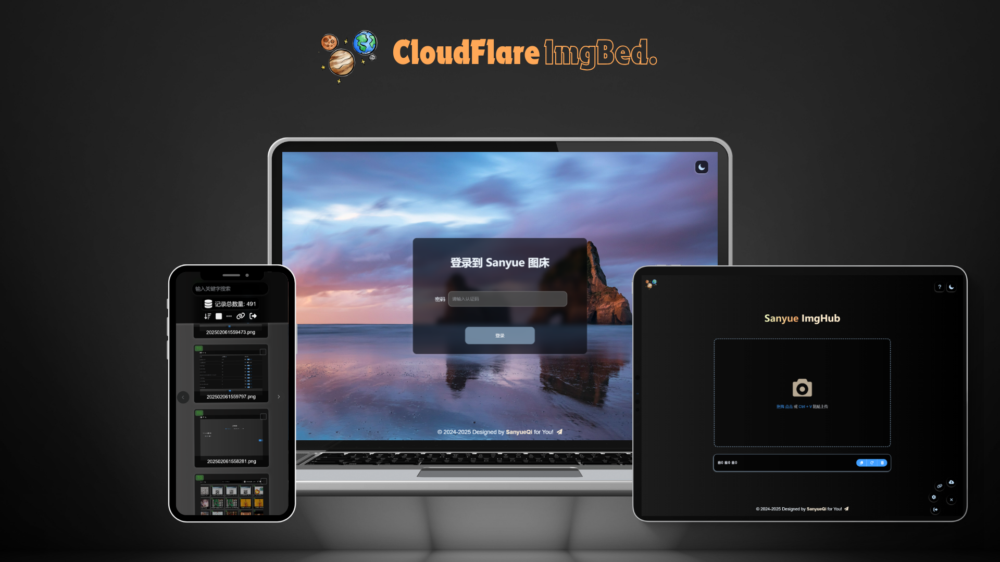
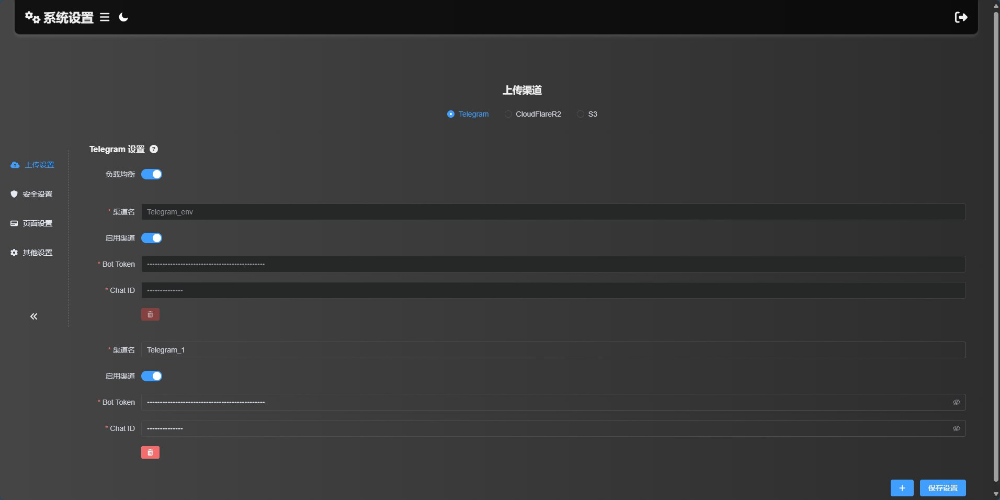

    
    
<em>🗂️开源文件托管解决方案，基于 Cloudflare Pages，支持 Telegram Bot 、 Cloudflare R2 、S3 等多种存储渠道</em>

    

        <a href="https://github.com/MarSeventh/CloudFlare-ImgBed/blob/main/README.md">简体中文</a>|<a href="https://github.com/MarSeventh/CloudFlare-ImgBed/blob/main/README_en.md">English</a>
    

    

        
        
        
        
        
        
        
    

---

> [!IMPORTANT]
>
> **v2.0 版本升级注意事项请查看公告！**

**🚀项目官网**：[CloudFlare ImgBed](https://cfbed.sanyue.de/)

    
公告

## 置顶

1. 部署使用出现问题，请先仔细查阅文档、常见问题解答以及已有issues。

2. **前端仓库**：[MarSeventh/Sanyue-ImgHub](https://github.com/MarSeventh/Sanyue-ImgHub)

3. **注意**：本仓库为[Telegraph-Image](https://github.com/cf-pages/Telegraph-Image)项目的重制版，如果你觉得本项目不错，在支持本项目的同时，也请支持原项目。

## 2025.2.6  V2.0 版本升级注意事项

> v2.0 beta 版已发布，相较于 v1.0 版本进行了大量改动和优化，但 beta 版本可能存在潜在不稳定性，若您追求稳定，可选择暂缓更新。
>
> 由于**构建命令发生了变化**，此次更新需要您**手动进行**，请按照以下步骤进行操作：
>
> - 同步fork的仓库至最新版（若已自动同步可忽略）
>
> - 前往 pages 管理页面，进入`设置`->`构建`，编辑`构建配置`，在`构建命令`处填写`npm install`
>
>   
>
> - 新版本所有设置项已**迁移至 管理端->系统设置 界面**，原则上无需再通过环境变量的方式进行设置，通过系统设置界面进行的设置将**覆盖掉**环境变量中的设置，但为了保证 **Telegram渠道的图片** 能够与旧版本相兼容，**若您之前设置了 Telegram 渠道相关的环境变量，请将其保留！**
>
> - 确保上述设置完成无误后，前往 pages 管理页面，进入`部署`，对最后一次不成功的部署进行`重试操作`

## 关于切换到 Telegram 渠道的通知

> 由于telegraph图床被滥用，该项目上传渠道已切换至Telegram Channel，请**更新至最新版（更新方式见第3.1章最后一节）**，按照文档中的部署要求**设置`TG_BOT_TOKEN`和`TG_CHAT_ID`**，否则将无法正常使用上传功能。
>
> 此外，目前**KV数据库为必须配置**，如果以前未配置请按照文档说明配置。
>
> 出现问题，请先查看第5节常见问题Q&A部分。

    
生态建设

## 1. 插件

- **编辑器内自动上传（油猴脚本）**：https://greasyfork.org/zh-CN/scripts/529816-image-uploader-to-markdown-to-cloudflare-imgbed （_作者：Linux.do: [calg_c](https://linux.do/u/calg_c/summary)_）

## 2.仓库

- **向TG BOT发送文件上传图床**：[uki0xc/img-up-bot: 使用telegram机器人链接图床进行上传](https://github.com/uki0xc/img-up-bot?tab=readme-ov-file) （_作者：[uki0xc](https://github.com/uki0xc)_)

    
体验地址及优质博文、视频（搭建或使用有问题可以先去里面学习哦~）

**体验地址**：[CloudFlare ImgBed](https://cfbed.1314883.xyz/)

> 访问码：cfbed

**体验视频**：[CloudFlare免费图床，轻松守护你的每一份精彩！_哔哩哔哩_bilibili](https://www.bilibili.com/video/BV1y3WGe4EGh/?vd_source=da5ecbe595e41089cd1bed95932b8bfd)

**相关教程视频**：

- [利用Cloudflare R2 +Pages搭建在线图床系统，不限空间，不被墙，超级简单，完全免费 (youtube.com)](https://www.youtube.com/watch?v=T8VayuUMOzM)

**相关优质博文（感谢每一位鼎力支持的热心大佬）：**

- [CloudFlare-ImgBed项目 – yunsen2025的小窝](https://www.yunsen2025.top/category/cloudflare-imgbed/)
  - [完全免费，图文教程手把手教你使用cloudflare搭建一个无限空间的私人图床 支持身份认证与成人元素鉴定！ - yunsen2025的小窝](https://www.yunsen2025.top/blog-cfpages-syq-imgbed)
  - [为CloudFlare-ImgBed图床配置国内CDN并分线路解析，以最低成本享受极致速度！ – yunsen2025的小窝](https://www.yunsen2025.top/cloudflare-imgbed-fen-xian-pei-zhi-guo-nei-cdn/)
- [利用cloudflare pages搭建telegram频道图床 (lepidus.me)](https://blogstr.lepidus.me/post/1725801323700/)
- [搭建基于CloudFlare和Telegram的免费图床教程 - 刘学馆 | Blog (sexy0769.com)](https://blog.sexy0769.com/skill/735.html)
- [CloudFlare+Github，打造属于自己的免费图床 - 大头钉的小小blog (luckyting.top)](https://luckyting.top/index.php/archives/20/)

## 最近更新

Add Features:

- 美化报错图片
- 上传页面支持预览ico等更多格式文件

    
更新日志

## 2025.6.13

Add Features:

- 美化报错图片
- 上传页面支持预览ico等更多格式文件

## 2025.6.12

Add Features:

- `upload`接口支持跨域访问和调用

Fix Bugs:

- 修复`list`接口返回数据完整性的问题

## 2025.5.23

Add Features:

- 增加公告功能

Fix Bugs:

- 修复后台图片名过长遮盖图片的问题
- 优化部分页面显示效果
- 修复 Docker 镜像无法访问 https 外链的问题

## 2025.5.11

Add Features:

- 支持通过Docker在服务器上部署

## 2025.3.14

Add Features:

- 上传用户管理支持显示IP具体位置

## 2025.3.8

Add Features:

- 随机图API支持按目录读取，支持按目录进行权限控制

Fix Bugs:

- 修复随机图API的缓存问题

## 2025.3.7

Add Features:

- **目录功能上线啦**，当前支持：
  - 上传到指定目录
  - 整目录删除
  - 文件位置移动（ Telegraph 和旧版 Telegram 渠道不支持移动）
  - 按目录读取文件
- 随机图API支持按目录读取

Fix Bugs:

- 修复多项影响体验的bug

## 2025.3.1

Add Features:

- 支持粘贴多个链接同时上传
- 支持存储和管理外链

Fix Bugs:

- 修复管理端复制 S3 链接的有关问题
- 修复管理端部分页面设置不生效的问题
- 修复渠道设置某些情况下不能保存的问题

## 2025.2.6

**v2.0版本焕新登场**，带来多项新功能和优化，给您焕然一新的用户体验：

💪**更强大**：

- 接入 S3 API 渠道，支持 Cloudflare R2 , Backblaze B2 ，七牛云，又拍云等多个服务商的对象存储服务
- 支持设置多个 Telegram 和 S3 渠道，支持多渠道负载均衡
- 上传文件支持短链接命名方式

✈️**更高效**：

- 全部设置项迁移到管理端系统设置界面，无需进行环境变量的繁琐配置，立即设置立即生效
- 管理端 Gallery 和 用户管理 等页面实现分页读取，提升前端渲染速度，优化使用体验
- 支持禁用、启用渠道，渠道管理自在掌握
- 多个设置项加入提示弹窗，不用到处翻阅文档，设置更踏实

✨**更精致**：

- 全局支持深色模式，根据用户喜好和时间自动切换，凸显满满高级感
- 登陆页面、图库页面、用户管理页面等多个页面细节重新打磨，操作更直观
- 上传页全新 Tab 栏，一拉一合，灵动又便捷
- Logo 焕新，纯手工打造，能力有限，不喜勿喷（
- 支持自定义隐藏页脚，强迫症患者有救啦

## 2024.12.27

Add Features:

- 支持通过环境变量自定义全局默认链接前缀（见3.1.3.6自定义配置接口）
- 管理端支持自定义链接前缀
- 管理端部分页面展示效果优化
- `/upload`API支持返回完整链接（请求时设置`returnFormat`参数，详见API文档）

Fix Bugs:

- 优化上传页面显示效果

## 2024.12.20

Add Features:

- 管理端支持拉黑上传IP（Dashboard->用户管理->允许上传）
- 管理端批量操作支持按照用户选择的顺序进行（[#issue124](https://github.com/MarSeventh/CloudFlare-ImgBed/issues/124)）
- `random`接口优化，减少KV操作次数，增加`content`参数，支持返回指定类型的文件
- 接入CloudFlare Cache API，提升 list 相关接口访问速度
- 正常读取返回图片的CDN缓存时间从1年调整为7天，防止缓存清除不成功的情况下图片长时间内仍可以访问的问题

## 2024.12.14

Add Features:

- 管理端增加批量黑名单、白名单功能

## 2024.12.13

Add Features:

- 优化blockimg、whitelistmode、404等返回状态的缓存策略，尽可能减少回源请求(参考文档`3.1.3.9管理端删除、拉黑等操作优化`进行设置)

## 2024.12.12

Add Features: 

- 后端支持上传失败自动切换其他渠道重试
- 优化404、blockimg、whitelistmode等返回状态的显示样式

## 2024.12.11

Add Features:

- 进行删除、加入白名单、加入黑名单等操作时，自动清除CF CDN缓存，避免延迟生效(参考文档`3.1.3.9管理端删除、拉黑等操作优化`进行设置)

## 2024.12.10

Add Features:

- 文件详情增加文件大小记录

## 2024.12.09

Add Features:

- 开放更多文件格式

Fix Bugs:

- 读取文件响应头增加允许跨域头`access-control-allow-origin: *`

## 2024.12.04

Add Features:

- 支持自定义命名方式（仅原名 or 仅随机前缀 or 默认的随机前缀_原名）
- Telegram Channel渠道上传文件记录机器人和频道数据，便于迁移和备份
- 支持自定义链接前缀

Fix Bugs:

- R2渠道在管理端删除时，存储桶同步删除

## 2024.11.05

Add Features:

- 增加对R2 bucket的支持

## 2024.10.20

Add Features:

- 页脚增加自定义传送门功能

## 2024.09.28

Add Features:

- 上传页面右下角工具栏样式重构，支持上传页自定义压缩（上传前+存储端）
- 增加仅删除上传成功图片、上传失败图片重试

## 2024.09.27

Add Features:

- 上传页面点击链接时，自动复制到剪切板
- 上传设置记忆（上传方式、链接格式等）

Fix Bugs:

- 若未设置密码，无需跳转登录页

## 2024.09.26

Add Features:

- 优化粘贴上传时的文件命名方法

## 2024.09.12

Add Features:

- 增加背景透明度支持自定义

## 2024.09.11

Add Features:

- 支持背景切换时间自定义

## 2024.08.26

Add Features:

- 支持大于5MB的图片上传前自动压缩
- 图床名称和Logo支持自定义
- 网站标题和Icon支持自定义

## 2024.08.23

Add Features:

- 支持URL粘贴上传

## 2024.08.21

Add Features:

- 完善多格式链接展示形式，增加UBB格式链接支持
- 完善登录逻辑，后端增加认证码校验接口

## 2024.07.25

Add Features:

- 增加随机图API

Fix Bugs:

- 修复API上传无法直接展示在后台的问题

## 2024.07.22

Add Features:

- 增加粘贴图片上传功能

## 2024.07.21

Add Features:

- 增加Markdown、HTML等格式链接复制功能
- 上传页面增加管理端入口

# 1.Introduction

免费文件托管解决方案，具有**上传**、**管理**、**读取**、**删除**等全链路功能，覆盖文件全生命周期，支持**鉴权**、**目录**、**图片审查**、**随机图**等各项特性。

# 2.Features

🚀[功能特性 | CloudFlare ImgBed](https://cfbed.sanyue.de/guide/features.html)

# 3.Deployment

🚀[快速开始 | CloudFlare ImgBed](https://cfbed.sanyue.de/guide/quick-start.html)

# 4.Show

    
其他页面效果展示

# 5.TODO

## 5.1Add Features💕

    
功能更新列表

1. :white_check_mark: ~~增加粘贴图片上传功能~~（2024.7.22已完成）
2. :white_check_mark:~~增加markdown、html等格式链接复制功能~~（2024.7.21已完成）
3. :white_check_mark:~~上传页面增加管理端入口~~（2024.7.21已完成）
4. :memo:增加用户个性化配置接口
   - ~~登录页面和上传页面背景图自定义~~（2024.8.25已完成）
   - ~~图床名称和Logo自定义~~（2024.8.26已完成）
   - ~~网站标题和Icon自定义~~（2024.8.26已完成）
   - ~~背景切换时间自定义~~（2024.9.11已完成）
   - ~~背景透明度支持自定义~~（2024.9.12已完成）
   - ~~页脚自定义传送门~~（2024.10.20已完成）
   - ~~全局自定义链接前缀~~（2024.12.27已完成）
   - ~~可隐藏页脚~~（2025.2.4已完成）
5. :white_check_mark:~~增加随机图API~~（2024.7.25已完成）
6. :white_check_mark:~~完善多格式链接展示形式，增加ubb格式链接支持~~（2024.8.21已完成）
7. :white_check_mark:~~完善登录逻辑，后端增加认证码校验接口~~（2024.8.21已完成）
8. :white_check_mark:~~支持URL粘贴上传~~（2024.8.23已完成）
9. :white_check_mark:~~支持大于5MB的图片上传前自动压缩~~（2024.8.26已完成）
10. :white_check_mark:~~上传页面右下角工具栏样式重构，支持上传页自定义压缩（上传前+存储端）~~（2024.9.28已完成）
11. :white_check_mark:~~重构管理端，认证+显示效果优化，增加图片详情页~~（2024.12.20已完成）
12. :white_check_mark:~~管理端增加访问量统计，IP记录、IP黑名单、上传IP黑名单等~~（2024.12.20已支持上传ip黑名单，访问记录由于对KV读写消耗太大，暂时搁置）
13. :white_check_mark:~~上传页面点击链接，自动复制到剪切板~~(2024.9.27已完成)
14. :white_check_mark:~~上传设置记忆（上传方式、链接格式等）~~（2024.9.27已完成，**两种上传方式合并**）
15. :white_check_mark:~~若未设置密码，无需跳转进入登录页~~（2024.9.27已完成）
16. :white_check_mark:~~增加仅删除上传成功图片、上传失败图片重试~~（2024.9.28已完成）
17. :white_check_mark:~~优化粘贴上传时文件命名方法~~（2024.9.26已完成）
18. :white_check_mark:~~增加对R2 bucket的支持~~（2024.11.5已完成）
19. :white_check_mark:~~管理端增加批量黑名单、白名单功能~~（2024.12.14已完成）
20. :white_check_mark:~~Telegram Channel渠道上传文件记录机器人和频道数据，便于迁移和备份~~（2024.12.4已完成）
21. :white_check_mark:~~支持自定义命名方式（仅原名 or 仅随机前缀 or 默认的随机前缀\_原名）~~（2024.12.4已完成）
22. :white_check_mark:~~支持上传失败自动切换其他渠道尝试~~（2024.12.12已完成）
23. :white_check_mark:~~后端list接口实现分页功能~~（2024.2.5已完成）
24. :white_check_mark:~~支持自定义链接前缀~~（2024.12.4已完成）
25. :memo:对接alist，或实现webdav（评估中）
26. :white_check_mark:~~文件详情增加文件大小记录~~（2024.12.10已完成）
27. :white_check_mark:~~支持管理员自定义全局默认链接前缀~~（2025.2.1已完成）
28. :white_check_mark:~~开放更多文件格式~~（2024.12.9已完成）
29. :white_check_mark:~~进行删除、加入白名单、加入黑名单等操作时，自动清除CF CDN缓存，避免延迟生效~~（2024.12.11已完成）
30. :white_check_mark:~~管理端批量选择时，记录用户选择的顺序~~（2024.12.20已完成）
31. :memo:上传图片支持自定义上传路径，支持相册功能
    - ~~文件夹删除功能~~（2025.3.6已完成）
    - ~~文件位置移动功能~~（2025.3.7已完成）
    - ~~管理端加载更多数据时鬼打墙问题修复~~（2025.3.6已完成）
    - ~~管理端批量操作适配文件夹~~（2025.3.6已完成）
    - ~~管理端分页逻辑调整~~（2025.3.6已完成）
32. :white_check_mark:~~支持多个 Telegram Bot Token 负载均衡~~（2025.2.4已完成）
33. :white_check_mark:~~管理端提供详细的设置信息和设置方式引导~~（2025.2.5已完成）
34. :white_check_mark:~~Logo焕新、登录页面优化、设置提示项等多项展示效果优化~~（2025.2.2已完成）
35. :white_check_mark:~~接入S3 API渠道~~（2024.2.3已完成）
36. :white_check_mark:~~支持短链接命名方式~~（2025.2.1已完成）
37. :white_check_mark:~~支持深色模式~~（2025.1.11已完成）
38. :hourglass_flowing_sand:支持KV备份恢复功能
39. :white_check_mark:~~页脚可自定义隐藏~~（2025.2.4已完成）
40. :hourglass_flowing_sand:搜索功能增强
41. :white_check_mark:支持粘贴多个链接，支持外链管理
42. :hourglass_flowing_sand:上传文件记录MD5，支持文件硬链接
43. :hourglass_flowing_sand:上传页面增加最近上传展示
44. :hourglass_flowing_sand:支持从后台管理处配置上传页默认设置
45. :white_check_mark:增加公告功能
46. :hourglass_flowing_sand:支持访问图片时设置宽高参数
47. :hourglass_flowing_sand:支持上传时转换图片格式

## 5.2Fix Bugs👻

    
Bug修复列表

1. :white_check_mark:~~修复API上传无法直接展示在后台的问题~~（2024.7.25已修复）
1. :white_check_mark:~~由于telegra.ph关闭上传，迁移至TG频道上传~~（2024.9.7已修复）
1. :white_check_mark:~~修复未设管理员认证时管理端无限刷新的问题~~（2024.9.9已修复）
1. :white_check_mark:~~修复部分视频无法预览播放的问题~~（经测试，暂定为文件自身存在问题，暂无法修复）
1. :hourglass_flowing_sand:增加新的图片审查渠道
1. :white_check_mark:~~R2渠道在管理端删除时，存储桶同步删除~~（2024.12.4已修复）
1. :white_check_mark:~~读取文件响应头增加允许跨域头`access-control-allow-origin: *`~~（2024.12.9已修复）
1. :white_check_mark:~~上传界面加入访问限制白名单~~（2024.12.11已修复）
1. :white_check_mark:修复文件名过长挡住操作按钮的问题
1. :white_check_mark:修复`list`接口返回数据完整性问题

# 6.Q&A

🚀[常见问题与解答 | CloudFlare ImgBed](https://cfbed.sanyue.de/qa/)

# 7.Tips

- 前端开源，参见[MarSeventh/Sanyue-ImgHub](https://github.com/MarSeventh/Sanyue-ImgHub)项目。

- **赞助**：项目维护不易，喜欢本项目的话，可以作者大大一点小小的鼓励哦，您的每一份支持都是我前进的动力\~ 

  
  
- **Sponsors**：感谢以下赞助者对本项目的支持！

   
  
- **Contributors**：感谢以下贡献者对本项目的无私贡献！

  

# 8.Star History

**如果觉得项目不错希望您能给个免费的star✨✨✨，非常感谢！**

# 9.Special Sponsors

- **[亚洲云](https://www.asiayun.com/)**：提供云计算服务资源支持（高防服务器|福州高防|广东电信|香港服务器|美国服务器|海外服务器）

- **DartNode**：提供云计算服务资源支持

