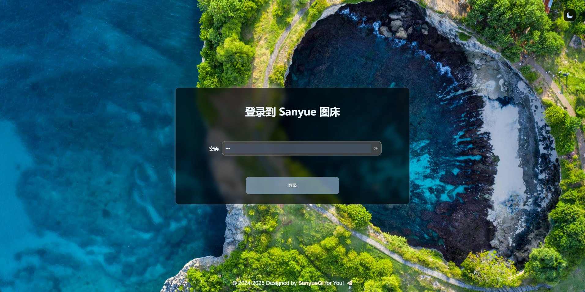
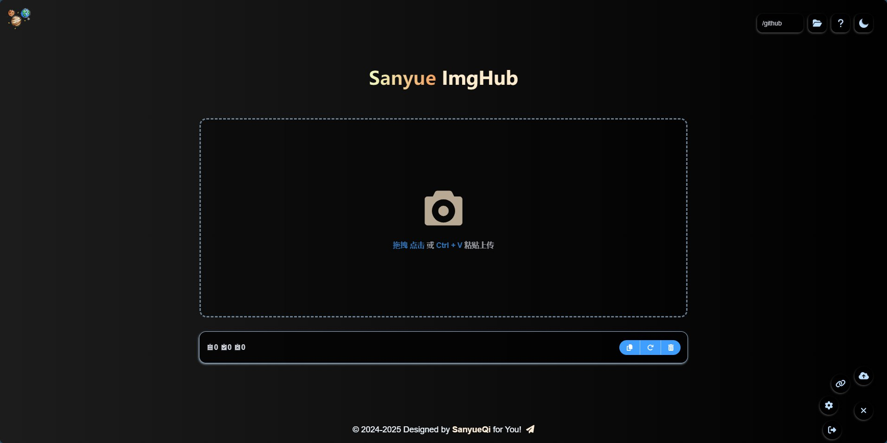
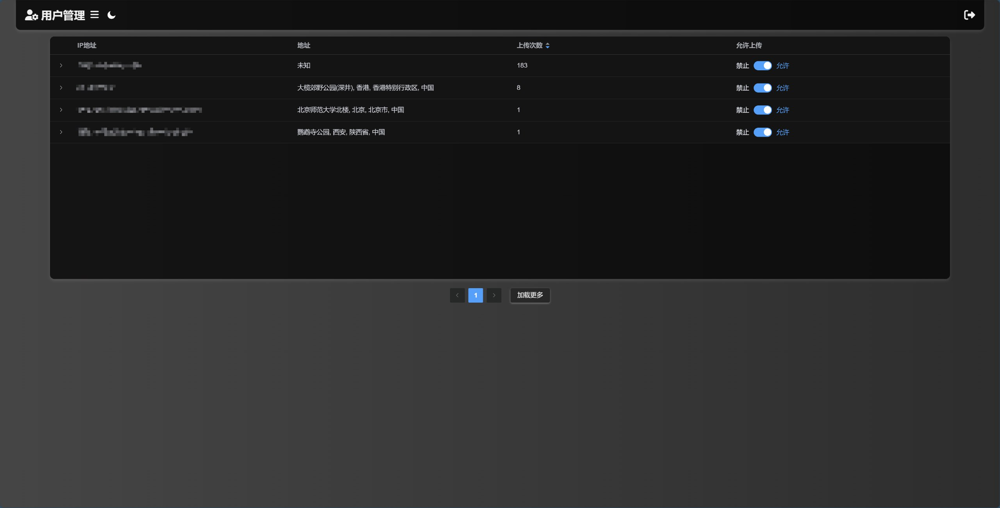

<div align="center">
    <a href="https://github.com/MarSeventh/CloudFlare-ImgBed"></a>
    <p><em>🗂️开源文件托管解决方案，支持 Docker 和无服务器部署，支持 Telegram Bot 、 Cloudflare R2 、S3 等多种存储渠道.</em> 魔改原版将KV改为D1存储</p>
    <p>
        <a href="https://github.com/ccxyChuzhong/CloudFlare-ImgBed-D1/blob/main/README.md">简体中文</a> | <a href="https://github.com/ccxyChuzhong/CloudFlare-ImgBed-D1/blob/main/README_en.md">English</a> | <a href="https://github.com/MarSeventh/CloudFlare-ImgBed">KV版本（原版）</a> | <a href="https://github.com/ccxyChuzhong/CloudFlare-ImgBed-D1">D1版本</a> | <a href="https://cfbed.sanyue.de">官方网站</a>
    </p>
    <div>
        <a href="https://github.com/MarSeventh/CloudFlare-ImgBed/blob/main/LICENSE">
        
        </a>
        <a href="https://github.com/MarSeventh/CloudFlare-ImgBed/releases">
        
        </a>
        <a href="https://github.com/MarSeventh/CloudFlare-ImgBed/releases">
        
        </a>
        <a href="https://hub.docker.com/r/marseventh/cloudflare-imgbed">
  		  
		</a>
        <a href="https://github.com/MarSeventh/CloudFlare-ImgBed/issues">
          
        </a>
        <a href="https://github.com/MarSeventh/CloudFlare-ImgBed/stargazers">
          
        </a>
        <a href="https://github.com/MarSeventh/CloudFlare-ImgBed/network/members">
          
        </a>
    </div>
</div>


---

> [!IMPORTANT]
>
> **v2.0 版本升级注意事项请查看公告！**


<details>
    <summary>公告</summary>


## 置顶

1. 部署使用出现问题，请先仔细查阅文档、常见问题解答以及已有issues。

2. **注意**：本仓库为[Telegraph-Image](https://github.com/cf-pages/Telegraph-Image)项目的重制版，如果你觉得本项目不错，在支持本项目的同时，也请支持原项目。

## 2025.2.6  V2.0 版本升级注意事项

> v2.0 版已发布，相较于 v1.0 版本进行了大量改动和优化，但 beta 版本可能存在潜在不稳定性，若您追求稳定，可选择暂缓更新。
>
> 由于**构建命令发生了变化**，此次更新需要您**手动进行**，请按照以下步骤进行操作：
>
> - 同步fork的仓库至最新版（若已自动同步可忽略）
>
> - 前往 pages 管理页面，进入`设置`->`构建`，编辑`构建配置`，在`构建命令`处填写`npm install`
>
> - 新版本所有设置项已**迁移至 管理端->系统设置 界面**，原则上无需再通过环境变量的方式进行设置，通过系统设置界面进行的设置将**覆盖掉**环境变量中的设置，但为了保证 **Telegram渠道的图片** 能够与旧版本相兼容，**若您之前设置了 Telegram 渠道相关的环境变量，请将其保留！**
>
> - 确保上述设置完成无误后，前往 pages 管理页面，进入`部署`，对最后一次不成功的部署进行`重试操作`

## 关于切换到 Telegram 渠道的通知


> 由于telegraph图床被滥用，该项目上传渠道已切换至Telegram Channel，请**更新至最新版（更新方式见第3.1章最后一节）**，按照文档中的部署要求**设置`TG_BOT_TOKEN`和`TG_CHAT_ID`**，否则将无法正常使用上传功能。
>
> 此外，目前**KV数据库为必须配置**，如果以前未配置请按照文档说明配置。
>
> 出现问题，请先查看第5节常见问题Q&A部分。

</details>


# 必看！必看 ！必看！
如果是使用KV存储想转D1存储。建议重新创建一个图床。使用系统的备份和恢复功能进行数据迁移！！！！

<details>
    <summary>KV转D1存储详细如下</summary>
    
- 首先确认您的 D1 数据库已经创建：数据库名称必须为： `imgbed-database` 将数据库sql语句一段一段的全部执行
```sql
-- CloudFlare ImgBed D1 Database Initialization Script
-- 这个脚本用于初始化D1数据库

-- 删除已存在的表（如果需要重新初始化）
-- 注意：在生产环境中使用时请谨慎
-- DROP TABLE IF EXISTS files;
-- DROP TABLE IF EXISTS settings;
-- DROP TABLE IF EXISTS index_operations;
-- DROP TABLE IF EXISTS index_metadata;
-- DROP TABLE IF EXISTS other_data;

-- 执行主要的数据库架构创建
-- 这里会包含 schema.sql 的内容

-- 1. 文件表 - 存储文件元数据
CREATE TABLE IF NOT EXISTS files (
    id TEXT PRIMARY KEY,
    value TEXT,
    metadata TEXT NOT NULL,
    file_name TEXT,
    file_type TEXT,
    file_size TEXT,
    upload_ip TEXT,
    upload_address TEXT,
    list_type TEXT,
    timestamp INTEGER,
    label TEXT,
    directory TEXT,
    channel TEXT,
    channel_name TEXT,
    tg_file_id TEXT,
    tg_chat_id TEXT,
    tg_bot_token TEXT,
    is_chunked BOOLEAN DEFAULT FALSE,
    created_at DATETIME DEFAULT CURRENT_TIMESTAMP,
    updated_at DATETIME DEFAULT CURRENT_TIMESTAMP
);

-- 2. 系统配置表
CREATE TABLE IF NOT EXISTS settings (
    key TEXT PRIMARY KEY,
    value TEXT NOT NULL,
    category TEXT,
    description TEXT,
    created_at DATETIME DEFAULT CURRENT_TIMESTAMP,
    updated_at DATETIME DEFAULT CURRENT_TIMESTAMP
);

-- 3. 索引操作表
CREATE TABLE IF NOT EXISTS index_operations (
    id TEXT PRIMARY KEY,
    type TEXT NOT NULL,
    timestamp INTEGER NOT NULL,
    data TEXT NOT NULL,
    processed BOOLEAN DEFAULT FALSE,
    created_at DATETIME DEFAULT CURRENT_TIMESTAMP
);

-- 4. 索引元数据表
CREATE TABLE IF NOT EXISTS index_metadata (
    key TEXT PRIMARY KEY,
    last_updated INTEGER,
    total_count INTEGER DEFAULT 0,
    last_operation_id TEXT,
    chunk_count INTEGER DEFAULT 0,
    chunk_size INTEGER DEFAULT 0,
    created_at DATETIME DEFAULT CURRENT_TIMESTAMP,
    updated_at DATETIME DEFAULT CURRENT_TIMESTAMP
);

-- 5. 其他数据表
CREATE TABLE IF NOT EXISTS other_data (
    key TEXT PRIMARY KEY,
    value TEXT NOT NULL,
    type TEXT,
    description TEXT,
    created_at DATETIME DEFAULT CURRENT_TIMESTAMP,
    updated_at DATETIME DEFAULT CURRENT_TIMESTAMP
);
-- 初始化完成
```

###  在 Cloudflare Dashboard 配置 Pages 绑定

#### 步骤 A: 登录 Cloudflare Dashboard
1. 访问 https://dash.cloudflare.com
2. 登录您的账户

#### 步骤 B: 进入 Pages 项目
1. 在左侧菜单中点击 **"Pages"**
2. 找到并点击您的图床项目

#### 步骤 C: 配置 Functions 绑定
1. 在项目页面中，点击 **"Settings"** 标签
2. 在左侧菜单中点击 **"Functions"**
3. 向下滚动找到 **"D1 database bindings"** 部分

#### 步骤 D: 添加 D1 绑定
1. 点击 **"Add binding"** 按钮
2. 填写以下信息：
   - **Variable name**: `DB` （必须是大写的 DB）
   - **D1 database**: 从下拉菜单中选择您创建的 `imgbed-database`
3. 点击 **"Save"** 按钮

#### 步骤 E: 重新部署 Pages

配置绑定后，需要重新部署：

#### 步骤 F: 验证配置

部署完成后，访问以下URL验证配置：

```
https://your-domain.com/api/manage/migrate?action=check
```

查看详细的配置状态
```
https://your-domain.com/api/manage/migrate?action=status
``` 
</details>


# 1. Introduction

免费文件托管解决方案，具有**上传**、**管理**、**读取**、**删除**等全链路功能，覆盖文件全生命周期，支持**鉴权**、**目录**、**图片审查**、**随机图**等各项特性（详见[功能文档](https://cfbed.sanyue.de/guide/features.html)）。


# 2. [Document](https://cfbed.sanyue.de)

提供详细的部署文档、功能文档、开发计划、更新日志、常见问题解答等，帮助您快速上手。

[](https://cfbed.sanyue.de/guide/update-log.html)

# 3. Demo

**演示站点**：[CloudFlare ImgBed](https://cfbed.1314883.xyz/) 访问密码：`cfbed`





<details>
    <summary>其他页面效果展示</summary>





</details>


# 4. Tips

- **前端开源**：参见[MarSeventh/Sanyue-ImgHub](https://github.com/MarSeventh/Sanyue-ImgHub)项目。

- **生态建设**：欢迎社区参与生态建设，欢迎提交 PR 或者 Issue，优质内容参见[官网生态建设页面](https://cfbed.sanyue.de/about/ecosystem.html)。

- **赞助**：项目维护不易，喜欢本项目的话，可以作者大大一点小小的鼓励哦，您的每一份支持都是我前进的动力\~ 

  <a href="https://afdian.com/a/marseventh"></a>
  
- **Sponsors**：感谢以下赞助者对本项目的支持！

  [](https://afdian.com/a/marseventh)
  
- **Contributors**：感谢以下贡献者对本项目的无私贡献！

  [](https://github.com/MarSeventh/CloudFlare-ImgBed/graphs/contributors)

# 5. Star History

**如果觉得项目不错希望您能给个免费的star✨✨✨，非常感谢！**

[](https://star-history.com/#MarSeventh/CloudFlare-ImgBed&MarSeventh/Sanyue-ImgHub&Date)

# 6. Special Sponsors

- **[CloudFlare](https://www.cloudflare.com) & [EdgeOne](https://edgeone.ai/?from=github)**：提供CDN加速和安全保护服务

  <a href="https://www.cloudflare.com"></a> <a href="https://edgeone.ai/?from=github"></a>

- **[亚洲云](https://www.asiayun.com) & [DartNode](https://dartnode.com)**：提供云计算服务资源支持

  [](https://dartnode.com "Powered by DartNode - Free VPS for Open Source")

