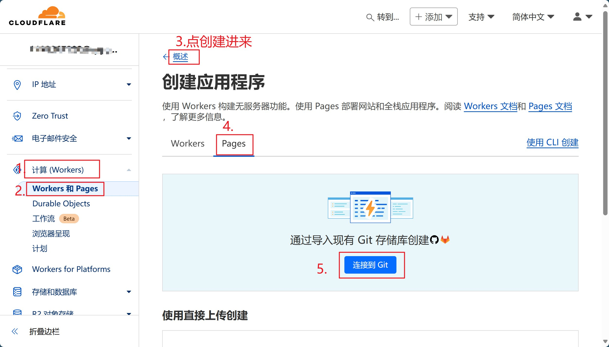
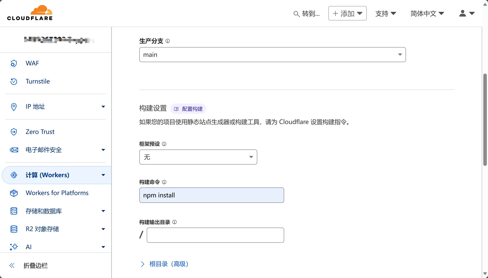

<div align="center">
    <a href="https://github.com/MarSeventh/CloudFlare-ImgBed"></a>
    <p><em>🗂️Open-source file hosting solution based on Cloudflare Pages, supporting multiple storage channels such as Telegram Bot, Cloudflare R2, S3, etc.</em></p>
    <p>
        <a href="https://github.com/MarSeventh/CloudFlare-ImgBed/blob/main/README.md">简体中文</a>|<a href="https://github.com/MarSeventh/CloudFlare-ImgBed/blob/main/README_en.md">English</a>
    </p>
    <div>
        <a href="https://github.com/MarSeventh/CloudFlare-ImgBed/blob/main/LICENSE">
        
        </a>
        <a href="https://github.com/MarSeventh/CloudFlare-ImgBed/releases">
        
        </a>
        <a href="https://github.com/MarSeventh/CloudFlare-ImgBed/releases">
        
        </a>
        <a href="https://hub.docker.com/r/marseventh/cloudflare-imgbed">
  		  
		</a>
        <a href="https://github.com/MarSeventh/CloudFlare-ImgBed/issues">
          
        </a>
        <a href="https://github.com/MarSeventh/CloudFlare-ImgBed/stargazers">
          
        </a>
        <a href="https://github.com/MarSeventh/CloudFlare-ImgBed/network/members">
          
        </a>
    </div>
</div>

---

> [!IMPORTANT]
>
> **Please check the announcement for upgrade notes on version 2.0!**

<details>
    <summary>Announcement</summary>

## Pinned

1. If you encounter issues during deployment or usage, please carefully read the documentation, FAQ, and existing issues first.

2. **Frontend repository**: [MarSeventh/Sanyue-ImgHub](https://github.com/MarSeventh/Sanyue-ImgHub)

3. **Note**: This repository is a remake of the [Telegraph-Image](https://github.com/cf-pages/Telegraph-Image) project. If you like this project, please support the original one as well.

## 2025.2.6 Version 2.0 Upgrade Notes

> The v2.0 beta version has been released, with many changes and optimizations compared to v1.0. However, the beta version may have potential instability. If you prefer stability, you may delay updating.
>
> Due to **changes in the build command**, this update requires **manual operation**. Please follow these steps:
>
> - Sync your forked repository to the latest version (ignore if already synced automatically)
>
> - Go to the Pages management page, enter `Settings` -> `Build`, edit the `Build configuration`, and set the `Build command` to `npm install`
>
>   
>
> - All new version settings have been **migrated to the Admin Panel -> System Settings** interface, so generally no need to configure environment variables anymore. Settings made in the system settings interface will **override** environment variable settings. However, to ensure compatibility of images uploaded via the Telegram channel with the old version, **please keep any previously set Telegram-related environment variables!**
>
> - After confirming the above settings are correct, go to the Pages management page, enter `Deployments`, and `Retry` the last failed deployment.

## Notification About Switching to Telegram Channel

> Due to abuse of the telegraph image hosting, the upload channel has switched to Telegram Channel. Please **update to the latest version (see the last section of chapter 3.1 for update instructions)** and set `TG_BOT_TOKEN` and `TG_CHAT_ID` according to the deployment requirements in the documentation, otherwise upload functionality will not work.
>
> Also, the **KV database is now mandatory**; if not configured before, please configure it as per the documentation.
>
> For issues, please check section 5 FAQ first.

</details>

<details>
    <summary>Ecosystem</summary>

## 1. Plugins

- **Auto upload inside editor (Tampermonkey script)**: https://greasyfork.org/zh-CN/scripts/529816-image-uploader-to-markdown-to-cloudflare-imgbed (Author: Linux.do: [calg_c](https://linux.do/u/calg_c/summary))

## 2. Repositories

- **Upload files to image hosting via TG BOT**: [uki0xc/img-up-bot: Upload using Telegram bot linked image hosting](https://github.com/uki0xc/img-up-bot?tab=readme-ov-file) (Author: [uki0xc](https://github.com/uki0xc))

</details>

<details>
    <summary>Experience Links and Quality Blogs/Videos (Good for learning deployment or usage issues)</summary>

**Experience site**: [CloudFlare ImgBed](https://cfbed.1314883.xyz/)

> Access code: cfbed

**Experience video**: [CloudFlare Free Image Hosting, easily protect your every wonderful moment! _ Bilibili](https://www.bilibili.com/video/BV1y3WGe4EGh/?vd_source=da5ecbe595e41089cd1bed95932b8bfd)

**Related tutorial videos**:

- [Build an online image hosting system using Cloudflare R2 + Pages, unlimited space, no blocking, super simple, completely free (youtube.com)](https://www.youtube.com/watch?v=T8VayuUMOzM)

**Related quality blogs (Thanks to every supportive contributor):**

- [CloudFlare-ImgBed project – yunsen2025's blog](https://www.yunsen2025.top/category/cloudflare-imgbed/)
  - [Completely free, step-by-step tutorial to build an unlimited space private image hosting with Cloudflare, supports authentication and adult content detection! - yunsen2025's blog](https://www.yunsen2025.top/blog-cfpages-syq-imgbed)
  - [Configure domestic CDN and split-line resolution for CloudFlare-ImgBed to enjoy ultimate speed at lowest cost! – yunsen2025's blog](https://www.yunsen2025.top/cloudflare-imgbed-fen-xian-pei-zhi-guo-nei-cdn/)
- [Build Telegram channel image hosting with Cloudflare Pages (lepidus.me)](https://blogstr.lepidus.me/post/1725801323700/)
- [Tutorial for free image hosting based on CloudFlare and Telegram - Liu Xueguan | Blog (sexy0769.com)](https://blog.sexy0769.com/skill/735.html)
- [CloudFlare + Github, build your own free image hosting - Datouding's small blog (luckyting.top)](https://luckyting.top/index.php/archives/20/)

</details>

## Recent Updates

Add Features:

- Beautify error images
- Upload page supports preview of ico and more formats

<details>
    <summary>Update Logs</summary>


## 2025.6.13

Add Features:

- Beautify error images
- Upload page supports preview of ico and more formats

## 2025.6.12

Add Features:

- `upload` API supports cross-origin access and invocation

Fix Bugs:

- Fix data completeness issue in `list` API response

## 2025.5.23

Add Features:

- Added announcement feature

Fix Bugs:

- Fix long image names covering images in backend
- Optimize some page display effects
- Fix Docker image unable to access https external links issue

## 2025.5.11

Add Features:

- Support deployment on server via Docker

## 2025.3.14

Add Features:

- Upload user management supports displaying IP location

## 2025.3.8

Add Features:

- Random image API supports directory reading and permission control by directory

Fix Bugs:

- Fix cache issue in random image API

## 2025.3.7

Add Features:

- **Directory feature launched**, currently supports:
  - Upload to specified directory
  - Delete entire directory
  - Move file location (Telegraph and old Telegram channels do not support move)
  - Read files by directory
- Random image API supports reading by directory

Fix Bugs:

- Fix multiple bugs affecting user experience

## 2025.3.1

Add Features:

- Support pasting multiple links for batch upload
- Support storing and managing external links

Fix Bugs:

- Fix issues copying S3 links in admin panel
- Fix some page settings not effective in admin panel
- Fix channel settings sometimes not saving

## 2025.2.6

**Version 2.0 is here with many new features and optimizations for a refreshed user experience:**

💪**More powerful**:

- Added S3 API channel support, including Cloudflare R2, Backblaze B2, Qiniu Cloud, Upyun, and other providers
- Support multiple Telegram and S3 channels with load balancing
- Upload supports short link naming

✈️**More efficient**:

- All settings migrated to admin system settings interface, no need for complicated environment variables, settings take effect immediately
- Admin gallery and user management pages implement pagination for faster frontend rendering and better experience
- Support disabling/enabling channels for flexible management
- Many settings have tooltip popups for easier configuration

✨**More refined**:

- Global dark mode support, auto-switch based on user preference and time, with a premium feel
- Login, gallery, user management pages polished for more intuitive operation
- New upload page tab bar, smooth and convenient
- Logo redesigned by hand, limited skills, please be kind
- Support custom hiding footer for perfectionists

## 2024.12.27

Add Features:

- Support custom global default link prefix via environment variable (see 3.1.3.6 custom config interface)
- Admin supports custom link prefix
- Some admin page display optimizations
- `/upload` API supports returning full link (set `returnFormat` parameter, see API docs)

Fix Bugs:

- Optimize upload page display

## 2024.12.20

Add Features:

- Admin supports blacklisting upload IPs (Dashboard->User Management->Allow Upload)
- Batch operations in admin follow user selection order ([#issue124](https://github.com/MarSeventh/CloudFlare-ImgBed/issues/124))
- `random` API optimized to reduce KV operations, added `content` parameter to specify file type
- Integrate CloudFlare Cache API to improve list API speed
- Adjust CDN cache time from 1 year to 7 days to prevent long cache retention when cache clearing fails

## 2024.12.14

Add Features:

- Admin adds batch blacklist and whitelist features

## 2024.12.13

Add Features:

- Optimize cache strategies for blockimg, whitelistmode, 404 statuses to reduce origin requests (see doc 3.1.3.9 admin delete/blacklist optimization)

## 2024.12.12

Add Features:

- Backend supports automatic retry with other channels on upload failure
- Optimize display styles for 404, blockimg, whitelistmode statuses

## 2024.12.11

Add Features:

- Auto clear CF CDN cache on delete, whitelist, blacklist operations to avoid delay (see doc 3.1.3.9 admin delete/blacklist optimization)

## 2024.12.10

Add Features:

- File details add file size record

## 2024.12.09

Add Features:

- Open more file formats

Fix Bugs:

- Add CORS header `access-control-allow-origin: *` in file response

## 2024.12.04

Add Features:

- Support custom naming methods (original only, random prefix only, or default random prefix_original)
- Telegram Channel upload records bot and channel data for migration and backup
- Support custom link prefix

Fix Bugs:

- R2 channel deletes bucket synchronously in admin

## 2024.11.05

Add Features:

- Added support for R2 bucket

## 2024.10.20

Add Features:

- Footer adds custom portal feature

## 2024.09.28

Add Features:

- Upload page bottom right toolbar restyled, supports custom compression (pre-upload + storage side)
- Add delete only successful uploads, retry failed uploads

## 2024.09.27

Add Features:

- Auto copy link to clipboard on click in upload page
- Upload settings memory (upload method, link format, etc.)

Fix Bugs:

- No password set, no redirect to login page needed

## 2024.09.26

Add Features:

- Optimize file naming method on paste upload

## 2024.09.12

Add Features:

- Add support for custom background opacity

## 2024.09.11

Add Features:

- Support custom background switch interval

## 2024.08.26

Add Features:

- Auto compress images larger than 5MB before upload
- Support custom image hosting name and logo
- Support custom website title and icon

## 2024.08.23

Add Features:

- Support URL paste upload

## 2024.08.21

Add Features:

- Improve multi-format link display, add UBB format support
- Improve login logic, backend adds auth code verification API

## 2024.07.25

Add Features:

- Add random image API

Fix Bugs:

- Fix API upload not showing directly in backend

## 2024.07.22

Add Features:

- Add paste image upload feature

## 2024.07.21

Add Features:

- Add Markdown, HTML, etc. format link copy feature
- Add admin panel entry on upload page

</details>


# 1. Introduction

Free file hosting solution with full lifecycle features including **upload**, **management**, **read**, and **delete**, supporting **authentication**, **directories**, **image moderation**, **random images**, and other features.


# 2. Features

<details>
    <summary>Project Features</summary>

- **Open source**
  
  - Frontend is open source (can be modified and packaged by yourself)
  
- **Cool animations**
  
  - Smooth and silky transition animations
  - Breathing light effect on file upload
  - Dynamic user experience
  
- **User-friendly upload**
  
  - **Supports most file formats**: supports most common **images, videos, gifs**, and many other file types
  - **Supports multiple storage channels**: supports **Telegram Bot**, **Cloudflare R2**, **S3**, etc., with one-click switching
    > Telegram Bot channel: upload size limit 20MB, client and server compression available
    >
    > Cloudflare R2 channel: no upload size limit but charges beyond free quota, see [Pricing | Cloudflare R2 docs](https://developers.cloudflare.com/r2/pricing/)
    >
    > 
  - **Multiple upload methods**: supports drag & drop, click, paste (Web/API)
    > 1. Paste upload supports **files** and **URLs**
    > 2. Supports batch upload (no limit on selected files, but max 10 files uploading simultaneously for stability)
    > 3. Shows real-time upload progress
    > 4. Uploaded images via Web and API can be directly displayed in admin panel
    > 5. Large images compressed on frontend to improve stability and loading; supports custom compression quality and enabling compression on frontend/backend
  - **Supports specifying upload directory**
  
- **Diverse copy options**

  - Supports **copy all** and **copy individually** (copy all concatenates all links with newlines)
    > 1. Supports **Markdown, HTML, BBCode, and raw link** formats
    > 2. Shows all four formats clearly after upload
  
  - Supports custom link prefix for easy integration with third-party CDN

- **Supports authentication and abuse prevention**
  - Web and API upload authentication (thanks to [hl128k](https://github.com/hl128k))
  - Domain access restrictions (thanks to [hl128k](https://github.com/hl128k))
  - Upload IP statistics and IP upload bans supported

- **Customizable pages**
  - **Background customization**
    > 1. Supports **single image**, **custom multi-image slideshow**, **Bing random image slideshow**, etc.
    > 2. Background opacity and switch interval customizable
  - **Website info customization**
    > 1. Custom image hosting name and logo
    > 2. Custom website title and icon
    > 3. Custom footer portal links
    > 4. Support hiding footer
  
- **Other small features**
  - Supports **random image** API to return a random image from the hosting

- **All original features**
  > 1. **Unlimited image storage**: upload unlimited images
  >
  > 2. No need to buy servers, hosted on Cloudflare network, free within Cloudflare free quota
  >
  > 3. No need to buy domain, can use free `*.pages.dev` subdomain from Cloudflare Pages or bind custom domains
  >
  > 4. Supports image moderation API to automatically block inappropriate images
  >
  > 5. Supports backend image management with preview, whitelist, blacklist, etc.

</details>

# 3. Deployment

## 3.1 Deployment and Usage

**Note: After modifying environment variables, redeploy to take effect**, see [last section of 3.1](#3.1.4-other-operation-guides); for **version update method**, also see [last section of 3.1](#3.1.4-other-operation-guides)

<details>
    <summary>Detailed Deployment Tutorial</summary>

### 3.1.1 Preparation

<details>
    <summary>Prepare according to the channels you want to enable</summary>

- Enable **Telegram Bot channel**: need Telegram's `TG_BOT_TOKEN` and `TG_CHAT_ID`

  <details>
      <summary>How to get TG_BOT_TOKEN and TG_CHAT_ID</summary>

  First, have a Telegram account, then follow these steps:

  1. Send `/newbot` to [@BotFather](https://t.me/BotFather), follow prompts to input bot name, username, etc. After success, get `TG_BOT_TOKEN`.

     

  2. Create a new Channel, enter channel management, set the created bot as channel admin.

     

  3. Forward a message from the new channel to [@VersaToolsBot](https://t.me/VersaToolsBot) to get `TG_CHAT_ID` (channel ID).

     

  </details>

- Enable **Cloudflare R2 channel**: create a Cloudflare R2 bucket, requires binding a payment method.

  <details>
      <summary>How to enable Cloudflare R2 channel</summary>

  1. Go to Cloudflare Dashboard, select `R2 Object Storage`

     

  2. Click `Create Bucket`, name it freely, then create.

     

  3. Optional: To enable image moderation, enable public access for the bucket via one of two methods shown. Remember the full public URL like `https://xxxx.xxx`

     

  </details>

- **S3 API channel**: Prepare `S3_ACCESS_KEY_ID`, `S3_SECRET_ACCESS_KEY`, `S3_BUCKET_NAME`, `S3_ENDPOINT` from your provider. (See [CloudFlare-ImgBed common S3 config tutorial – yunsen2025's blog](https://www.yunsen2025.top/cloudflare-imgbed-s3-she-zhi/))

</details>

---

### 3.1.2 Deployment Tutorial

<details>
    <summary>Deploy on Cloudflare or Server according to your needs</summary>

#### 3.1.2.1 Deploy on Cloudflare

Prepare a **Cloudflare account**, then follow these steps:

<details>
    <summary>Steps to deploy on Cloudflare Pages</summary>

1. Fork this repository

2. Open Cloudflare Dashboard, go to Pages management, create a project, select `Connect to Git provider`

   

3. Enter project name, select the git repo, click `Begin setup`

4. Fill `Project name`, set build command to `npm install`, click `Save and deploy`

   

5. **Bind KV database**:

   - Create a new KV namespace

     > 
     >
     > 

   - Go to project `Settings` -> `Bindings` -> `Add` -> `KV Namespace`, set variable name `img_url`, select the created KV namespace

6. **Retry deployment**: Go to project management -> `Deployments` -> click the `...` next to the latest deployment -> `Retry deployment`

7. Configure storage channels as needed:

   - For `Cloudflare R2` channel:

     Bind the previously created bucket to the project (same place as KV binding), variable name `img_r2`

     > 

     To enable R2 image moderation, set the public access URL in project management -> system settings -> upload settings

   - For other channels: go to `https://your.domain/systemConfig#upload` and fill in channel parameters obtained in 3.1, save settings

</details>

#### 3.1.2.2 Deploy on Server

If Cloudflare's limited access times cannot meet your needs and you have your own server, you can simulate Cloudflare environment on your server and open corresponding ports to access the service.

Note that due to diverse OS and hardware, this tutorial may not suit everyone. Use search engines for errors or open issues for help.

<details>
    <summary>Docker Compose deployment (recommended)</summary>

1. Create `docker-compose.yml` file, copy content from project root's [docker-compose.yml](https://github.com/MarSeventh/CloudFlare-ImgBed/blob/main/docker-compose.yml).

2. Create `wrangler.toml` config file in the same directory with project name, env vars, etc. (see official docs [Configuration - Wrangler (cloudflare.com)](https://developers.cloudflare.com/workers/wrangler/configuration/))

   > Sample config:
   >
   > ```
   > name = "cloudflare-imgbed"
   > compatibility_date = "2024-07-24"
   > ```

3. Run `docker compose up -d` to start container, access service at `http://127.0.0.1:7658`.

</details>

<details>
    <summary>Manual deployment</summary>

1. Install node.js corresponding to your server OS, tested with v22.5.1 (search installation tutorials)

2. In project root, run `npm install` to install dependencies.

3. Create `wrangler.toml` in project root with project name, env vars, etc.

   > Sample:
   >
   > ```
   > name = "cloudflare-imgbed"
   > compatibility_date = "2024-07-24"
   > ```

4. Run `npm run start` in project root. Normally this deploys the project successfully. The project supports local simulated R2 storage upload by default; configure other settings in admin system settings page.

   Default port is 8080; use nginx or similar to reverse proxy `127.0.0.1:8080` for external access. To change port, modify `start` script's `port` parameter in `package.json`:
   
   ```json
   "scripts": {
       "ci-test": "concurrently --kill-others "npm start" "wait-on http://localhost:8080 && mocha"",
       "test": "mocha",
       "start": "npx wrangler pages dev ./ --kv "img_url" --r2 "img_r2" --port 8080 --persist-to ./data"
   }
   ```
   
   On successful start, console output like:
   
   
   
   </details>
   
   </details>
   
   ---
   
   ### 3.1.3 Optional Configuration
   
   <details>
    <summary>v2.0 Admin authentication, custom pages, cache clearing, etc.</summary>
   
   Please go to Admin Panel -> System Settings and follow prompts. For unclear settings, refer to v1.0 settings description below.
   
   </details>
   
   <details>
    <summary>(Deprecated, partial reference) v1.0 Admin authentication, custom pages, cache clearing, etc.</summary>
   
   #### 3.1.3.1 Admin Authentication
   
   By default, admin panel has **no password**. To set authentication:
   
   1. Configure admin credentials:
   
   - In project `Settings` -> `Environment variables` -> `Define variables for production` -> `Edit variables`, add `BASIC_USER` as admin username and `BASIC_PASS` as admin password.
   
   2. Redeploy project:
   
   - Go to project `Deployments` -> `All deployments`, select latest, click `...` -> `Retry deployment`
   
   - After deployment, visit `http(s)://your.domain/dashboard` to access admin panel.
   
   #### 3.1.3.2 Image Moderation
   
   Supports adult content moderation and auto blocking:
   
   - Register at https://moderatecontent.com/ to get free API key
   
   - In Cloudflare Pages project management, add environment variable `ModerateContentApiKey` with the API key.
   
   #### 3.1.3.3 Web and API Upload Authentication
   
   Add environment variable `AUTH_CODE` with your desired code.
   
   Web login page requires this code; API upload requires `authCode` parameter in upload URL.
   
   #### 3.1.3.4 Domain Access Restriction
   
   Add environment variable `ALLOWED_DOMAINS` with comma-separated allowed domains, e.g. `domain.xyz,domain.cloudns.be,domain.pp.ua`
   
   #### 3.1.3.5 Whitelist Mode
   
   Add environment variable `WhiteList_Mode` set to `true` to enable whitelist mode, only whitelisted images accessible.
   
   #### 3.1.3.6 Custom Config Interface
   
   <details>
    <summary>How to set</summary>
   
   Add environment variable `USER_CONFIG` in JSON format (set type to `text`). Fields and usage:
   
   | Field         | Purpose                       | Type         | Content Specification                                        |
   | ------------- | ----------------------------- | ------------ | ------------------------------------------------------------ |
   | loginBkImg    | Custom login page background  | List/String  | 1. If list, elements are image URLs for slideshow (single image means fixed background), e.g. `["1.jpg","2.jpg"]`<br>2. If string, only supports `"bing"` to enable Bing random image slideshow. |
   | uploadBkImg   | Custom upload page background | List/String  | Same as above                                                |
   | bkInterval    | Background slideshow interval | Positive int | Interval in ms, default 3000. E.g. 10000 for 10s switch      |
   | bkOpacity     | Background opacity            | Float (0,1]  | Default 1.0, can customize like 0.8                          |
   | ownerName     | Image hosting name in page    | String       | Custom hosting name (default `Sanyue`)                       |
   | logoUrl       | Image hosting logo URL        | String       | Custom logo URL                                              |
   | siteTitle     | Website title                 | String       | Custom website title                                         |
   | siteIcon      | Website icon URL              | String       | Custom icon URL                                              |
   | footerLink    | Footer portal link            | String       | Custom footer link (e.g. personal blog)                      |
   | disableFooter | Disable footer                | Boolean      | `true` to disable footer, default `false`                    |
   | urlPrefix     | Global default link prefix    | String       | Custom global default link prefix, overrides original default but not user custom prefix |
   
   > Example:
   >
   > ```
   > Slideshow mode:
   > {
   > "uploadBkImg": ["https://imgbed.sanyue.site/file/6910f0b5e65ed462c1362.jpg","https://imgbed.sanyue.site/file/a73c97a1e8149114dc750.jpg"],
   > "loginBkImg":["https://imgbed.sanyue.site/file/ef803977f35a4ef4c03c2.jpg","https://imgbed.sanyue.site/file/0dbd5add3605a0b2e8994.jpg"],
   > "ownerName": "Sanyue",
   > "logoUrl": "https://demo-cloudflare-imgbed.pages.dev/random?type=img"
   > }
   > Bing random image mode:
   > {
   > "uploadBkImg": "bing",
   > "loginBkImg": "bing"
   > }
   > ```
   
   </details>
   
   #### 3.1.3.7 Remote Telemetry
   
   Helps developers catch bugs but may collect access links, domains, etc. To opt out, add environment variable `disable_telemetry` set to `true`.
   
   #### 3.1.3.8 Random Image API
   
   Set environment variable `AllowRandom` to `true` to enable random image API (see API docs).
   
   #### 3.1.3.9 Admin delete/blacklist operation optimization (cache clearing)
   
   Due to Cloudflare CDN cache, delete/blacklist/whitelist operations may not take effect immediately.
   
   To make operations effective immediately, add environment variables `CF_ZONE_ID`, `CF_EMAIL`, `CF_API_KEY`.
   
   <details>
    <summary>How to get these</summary>
   
   `CF_ZONE_ID`:
   
   
   
   `CF_EMAIL`: your Cloudflare account email
   
   `CF_API_KEY`:
   
   
   
   </details>
   
   ##### </details>
   
   ---
   
   ### 3.1.4 Other Operation Guides
   
   <details>
    <summary>Environment variable modification, program update, etc.</summary>
   
   1. **How to modify environment variables**:
   
   
   
   **Redeploy required after modification!**
   
   
   
   2. **How to update program**:
   
   Go to your forked repo on Github, select `Sync fork` -> `Update branch`. Cloudflare Pages will detect and auto deploy the latest code.
   
   If new env vars are needed, add them and retry deployment.
   
   
   
   </details>
   
   </details>
   
   ## 3.2 Customization
   
   After deploying following `3.1`, go to [MarSeventh/Sanyue-ImgHub](https://github.com/MarSeventh/Sanyue-ImgHub?tab=readme-ov-file) repo, follow DIY and packaging instructions, then replace the `/dist` folder content into this repo root (copy + replace).
   
   # 4. Usage
   
   ## 4.1 Web Usage
   
   
   
   
   
   <details>
    <summary>Other page screenshots</summary>
   
   
   
   
   
   
   
   </details>
   
   ## 4.2 API Documentation
   
   <details>
    <summary>API Docs</summary>
   
   ### 4.2.1 Upload API
   
   | Interface      | /upload                                                      |
   | -------------- | ------------------------------------------------------------ |
   | **Function**   | Upload images or videos                                      |
   | **Method**     | POST                                                         |
   | **Parameters** | **Query**:<br>`authCode`: string, your auth code<br>`serverCompress`: boolean, enable server compression (images only, Telegram channel only, default `true`)<br>`uploadChannel`: string, one of `telegram`, `cfr2`, `s3`, default `telegram`<br>`autoRetry`: boolean, enable auto retry on failure, default true<br>`uploadNameType`: string, one of `[default, index, origin, short]` naming methods, default `default`<br>`returnFormat`: string, one of `[default, full]`, default `/file/id` format<br>`uploadFolder`: string, relative path for upload directory, e.g. `img/test`<br>**Body (form-data)**:<br>`file`: file to upload |
   | **Response**   | `data[0].src` is the image link (without domain, add yourself) |
   
   > **Example request**:
   >
   > ```
   > curl --location --request POST 'https://your.domain/upload?authCode=your_authCode' \
   > --header 'User-Agent: Apifox/1.0.0 (https://apifox.com)' \
   > --form 'file=@"D:\\杂文件\\壁纸\\genshin109.jpg"'
   > ```
   >
   > **Example response**:
   >
   > ```
   > [
   > {
   >   "src": "/file/738a8aaacf4d88d1590f9.jpg"
   > }
   > ]
   > ```
   
   ### 4.2.2 Random Image API
   
   | Interface        | /random                                                      |
   | ---------------- | ------------------------------------------------------------ |
   | **Function**     | Return a random image link from hosting (consumes quota)     |
   | **Precondition** | Set `AllowRandom` env var to `true`                          |
   | **Method**       | GET                                                          |
   | **Parameters**   | **Query**:<br>`content`: file types to return, options `[image, video]`, multiple separated by `,`, default `image`<br>`type`: if `img` returns image directly (ignores `form`), if `url` returns full URL, default returns file path<br>`form`: if `text` returns plain text, default JSON<br>`dir`: directory to read, relative path, e.g. `img/test` returns files in that directory and subdirs |
   | **Response**     | 1. If `type=img`, returns `image/jpeg`<br>2. Otherwise, if `form` not `text`, returns JSON with `data.url` link/path, else plain text link/path |
   
   > **Example request**:
   >
   > ```
   > curl --location --request GET 'https://your.domain/random' \
   > --header 'User-Agent: Apifox/1.0.0 (https://apifox.com)'
   > ```
   >
   > **Example response**:
   >
   > ```
   > {
   > "url": "/file/4fab4d423d039b4665a27.jpg"
   > }
   > ```
   
   </details>
   
   # 5. TODO
   
   ## 5.1 Add Features 💕
   
   <details>
    <summary>Feature update list</summary>
   
   1. :white_check_mark: ~~Add paste image upload feature~~ (completed 2024.7.22)
   2. :white_check_mark: ~~Add markdown, html format link copy~~ (completed 2024.7.21)
   3. :white_check_mark: ~~Add admin panel entry on upload page~~ (completed 2024.7.21)
   4. :memo: Add user customization interface
   
      - ~~Custom login and upload page backgrounds~~ (completed 2024.8.25)
      - ~~Custom image hosting name and logo~~ (completed 2024.8.26)
      - ~~Custom website title and icon~~ (completed 2024.8.26)
      - ~~Custom background switch interval~~ (completed 2024.9.11)
      - ~~Custom background opacity~~ (completed 2024.9.12)
      - ~~Custom footer portal~~ (completed 2024.10.20)
      - ~~Global custom link prefix~~ (completed 2024.12.27)
      - ~~Footer hide option~~ (completed 2025.2.4)
   5. :white_check_mark: ~~Add random image API~~ (completed 2024.7.25)
   6. :white_check_mark: ~~Improve multi-format link display, add UBB support~~ (completed 2024.8.21)
   7. :white_check_mark: ~~Improve login logic, add backend auth code verification~~ (completed 2024.8.21)
   8. :white_check_mark: ~~Support URL paste upload~~ (completed 2024.8.23)
   9. :white_check_mark: ~~Auto compress images >5MB before upload~~ (completed 2024.8.26)
   10. :white_check_mark: ~~Restyle upload page toolbar, support custom compression~~ (completed 2024.9.28)
   11. :white_check_mark: ~~Refactor admin, add authentication and display optimization, add image detail page~~ (completed 2024.12.20)
   12. :white_check_mark: ~~Add visit statistics, IP record, IP blacklist, upload IP blacklist in admin~~ (upload IP blacklist done, visit record postponed)
   13. :white_check_mark: ~~Auto copy link on upload page click~~ (completed 2024.9.27)
   14. :white_check_mark: ~~Upload settings memory (method, link format)~~ (completed 2024.9.27, merged upload methods)
   15. :white_check_mark: ~~No password set, no redirect to login~~ (completed 2024.9.27)
   16. :white_check_mark: ~~Add delete only successful uploads, retry failed uploads~~ (completed 2024.9.28)
   17. :white_check_mark: ~~Optimize file naming on paste upload~~ (completed 2024.9.26)
   18. :white_check_mark: ~~Add R2 bucket support~~ (completed 2024.11.5)
   19. :white_check_mark: ~~Add batch blacklist and whitelist in admin~~ (completed 2024.12.14)
   20. :white_check_mark: ~~Telegram Channel upload records bot and channel data for migration/backup~~ (completed 2024.12.4)
   21. :white_check_mark: ~~Support custom naming methods~~ (completed 2024.12.4)
   22. :white_check_mark: ~~Support auto retry with other channels on upload failure~~ (completed 2024.12.12)
   23. :white_check_mark: ~~Backend list API pagination~~ (completed 2024.2.5)
   24. :white_check_mark: ~~Support custom link prefix~~ (completed 2024.12.4)
   25. :memo: Integrate alist or implement webdav (under evaluation)
   26. :white_check_mark: ~~Add file size record in details~~ (completed 2024.12.10)
   27. :white_check_mark: ~~Support admin custom global default link prefix~~ (completed 2025.2.1)
   28. :white_check_mark: ~~Open more file formats~~ (completed 2024.12.9)
   29. :white_check_mark: ~~Auto clear CF CDN cache on delete, whitelist, blacklist~~ (completed 2024.12.11)
   30. :white_check_mark: ~~Admin batch selection remembers user order~~ (completed 2024.12.20)
   31. :memo: Support custom upload path and album feature
   
        - ~~Folder delete~~ (completed 2025.3.6)
        - ~~File move~~ (completed 2025.3.7)
        - ~~Fix ghost click bug on admin load more~~ (completed 2025.3.6)
        - ~~Batch operations support folders~~ (completed 2025.3.6)
        - ~~Admin pagination logic adjustment~~ (completed 2025.3.6)
   32. :white_check_mark: ~~Support multiple Telegram Bot Token load balancing~~ (completed 2025.2.4)
   33. :white_check_mark: ~~Admin provides detailed setting info and guidance~~ (completed 2025.2.5)
   34. :white_check_mark: ~~Logo redesign, login page optimization, setting tooltips~~ (completed 2025.2.2)
   35. :white_check_mark: ~~Add S3 API channel~~ (completed 2024.2.3)
   36. :white_check_mark: ~~Support short link naming~~ (completed 2025.2.1)
   37. :white_check_mark: ~~Support dark mode~~ (completed 2025.1.11)
   38. :hourglass_flowing_sand: Support KV backup and restore
   39. :white_check_mark: ~~Footer can be hidden~~ (completed 2025.2.4)
   40. :hourglass_flowing_sand: Search function enhancement
   41. :white_check_mark: Support pasting multiple links and external link management
   42. :hourglass_flowing_sand: Upload file MD5 record and hard link support
   43. :hourglass_flowing_sand: Upload page recent uploads display
   44. :hourglass_flowing_sand: Configure upload page default settings from admin
   45. :white_check_mark: Add announcement feature
   46. :hourglass_flowing_sand: Support width/height params on image access
   47. :hourglass_flowing_sand: Support image format conversion on upload
   
   </details>
   
   ## 5.2 Fix Bugs 👻
   
   <details>
    <summary>Bug fix list</summary>
   
   1. :white_check_mark: ~~Fix API upload not showing in backend~~ (fixed 2024.7.25)
   2. :white_check_mark: ~~Migrate upload to TG channel due to telegra.ph closure~~ (fixed 2024.9.7)
   3. :white_check_mark: ~~Fix infinite refresh when no admin auth set~~ (fixed 2024.9.9)
   4. :white_check_mark: ~~Fix some videos not previewing (likely file issue)~~
   5. :hourglass_flowing_sand: Add new image moderation channel
   6. :white_check_mark: ~~R2 channel deletes bucket synchronously in admin~~ (fixed 2024.12.4)
   7. :white_check_mark: ~~Add CORS header `access-control-allow-origin: *` in file response~~ (fixed 2024.12.9)
   8. :white_check_mark: ~~Add upload page access restriction whitelist~~ (fixed 2024.12.11)
   9. :white_check_mark: Fix long file names covering buttons
   10. :white_check_mark: Fix `list` API data completeness
   
   </details>
   
   # 6. Q&A
   
   <details>
    <summary>Frequently Asked Questions</summary>
   
   ## 6.1 Cannot cross-origin access without setting `ALLOWED_DOMAINS`?
   
   - Check your Cloudflare firewall settings (e.g. hotlink protection)
   - See [Issue #8](https://github.com/MarSeventh/CloudFlare-ImgBed/issues/8)
   
   ## 6.2 How to upload via PicGo?
   
   - Search `web-uploader` in PicGo plugins, install custom prefix version:
   
   
   
   - In `Image Host Settings` -> `Custom Web Host` -> `Default`, configure as below, modify API URL and custom image URL prefix to your domain. (**If `AUTH_CODE` is set, add `?authCode=your_authCode` to API URL**):
   
   
   
   - Confirm to use PicGo uploading to your self-hosted image hosting.
   
   ## 6.3 Upload failed?
   
   - Check if `TG_BOT_TOKEN`, `TG_CHAT_ID` env vars are correct
   - Check if bot has sufficient admin permissions
   - Check if KV database is correctly bound
   - Check if updated to latest version
   - Search issues for similar problems
   
   ## 6.4 Does `TG_CHAT_ID` have a leading `-`?
   
   - Yes, see images, it has a leading `-`
   
   ## 6.5 Admin page loads no records or images?
   
   - Network issue, try refreshing
   
   ## 6.6 Delete, blacklist operations in admin not effective immediately?
   
   - Related to CDN cache
   - See [[Important] About CDN cache (delete, blacklist delay solution) · Issue #123 · MarSeventh/CloudFlare-ImgBed (github.com)](https://github.com/MarSeventh/CloudFlare-ImgBed/issues/123)
   
   </details>
   
   # 7. Tips
   
   - Frontend is open source, see [MarSeventh/Sanyue-ImgHub](https://github.com/MarSeventh/Sanyue-ImgHub).
   
   - **Sponsor**: Maintaining the project is not easy. If you like it, please support the author. Your support is the motivation to keep going~
   
   <a href="https://afdian.com/a/marseventh"></a>
   
   - **Sponsors**: Thanks to the following sponsors for supporting this project!
   
   <a href="https://afdian.com/a/nothin">
        
      </a> <a href="https://afdian.com/u/1acef0be02d911ee90695254001e7c00">
        </a><a href="https://afdian.com/u/412189a0284911eca59f52540025c377">
        </a><a href="https://afdian.com/u/5e52ece217bc11f0ae3352540025c377">
        </a><a href="https://afdian.com/u/42e1c47e16a411f0baff52540025c377">
        </a><a href="https://afdian.com/a/yono233">
        </a><a href="https://afdian.com/a/XinToolKit">
        </a><a href="https://www.yunsen2025.top">
        </a>
   
   - **Contributors**: Thanks to the following contributors for their selfless contributions!
   
   [](https://github.com/MarSeventh/CloudFlare-ImgBed/graphs/contributors)
   
   # 8. Star History
   
   **If you like the project, please give a free star✨✨✨, thank you very much!**
   
   [](https://star-history.com/#MarSeventh/CloudFlare-ImgBed&MarSeventh/Sanyue-ImgHub&Date)
   
   # 9. Special Sponsors
   
   - **[AsiaYun](https://www.asiayun.com/)**: Provides cloud computing resources support (high defense servers | Fuzhou high defense | Guangdong Telecom | Hong Kong servers | US servers | Overseas servers)
   
   - **DartNode**: Provides cloud computing resources support
   
   [](https://dartnode.com "Powered by DartNode - Free VPS for Open Source")